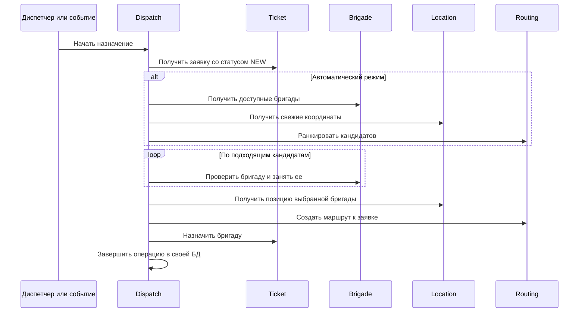

# Сервис диспетчеризации (Dispatch Service)

## Общее описание и общий принцип работы

`Dispatch_Service` координирует назначение бригады на новую заявку. Он не
владеет карточками заявок, бригад, координатами и маршрутами, поэтому связывает
четыре gRPC-сервиса: `Ticket`, `Brigade`, `Location` и `Routing`.
PostgreSQL хранит собственную операцию назначения и исходящие события.

Ручной режим создает операцию и резервирует выбранную бригаду. Автоматический
режим получает доступные бригады, отбрасывает тех, у кого нет свежей позиции,
ранжирует оставшихся по маршруту, пробует резервировать достижимых кандидатов и
подтверждает первого успешного. Подтверждение строит маршрут и меняет состояние
заявки. Версия операции обеспечивает оптимистическую блокировку.

### Схема назначения



При ошибке подтверждения сервис отменяет созданный маршрут или освобождает
бригаду в зависимости от достигнутого этапа. Последовательность и условия
переходов заданы в [`workflow.go`](src/core/service/workflow.go).

## Модели

### Перечисления

| Тип | Значения | Назначение |
|---|---|---|
| `Mode` | `MANUAL`, `AUTOMATIC` | Ручное или автоматическое назначение. |
| `Status` | `PENDING`, `RESERVED`, `CONFIRMING`, `ASSIGNED`, `FAILED`, `CANCELLED`, `EXPIRED` | Этап жизненного цикла операции. |

### `Operation`

| Поле | Тип Go | Назначение |
|---|---|---|
| `ID` | `uuid.UUID` | Идентификатор операции. |
| `TicketID` | `uuid.UUID` | Назначаемая заявка. |
| `DepartmentID` | `*uuid.UUID` | Подразделение из снимка заявки. |
| `CategoryID` | `*uuid.UUID` | Категория из снимка заявки. |
| `Priority` | `string` | Приоритет без приставки перечисления protobuf. |
| `BrigadeID` | `*uuid.UUID` | Зарезервированная бригада. |
| `RouteID` | `*uuid.UUID` | Созданный маршрут. |
| `Mode` | `Mode` | Способ назначения. |
| `Status` | `Status` | Текущий этап. |
| `Version` | `int32` | Версия для условных переходов. |
| `RequestedBy` | `uuid.UUID` | Пользователь, начавший операцию. |
| `FailureReason` | `*string` | Полный текст причины сбоя. |
| `FailureCode` | `*string` | Нормализованный код. |
| `FailureStage` | `*string` | Этап сбоя. |
| `ExpiresAt` | `time.Time` | Окончание резерва. |
| `CreatedAt`, `UpdatedAt` | `time.Time` | Времена создания и изменения. |

### Входные модели и кандидат

| Структура | Поля и назначение |
|---|---|
| `CreateOperationInput` | `TicketID`, `DepartmentID`, `CategoryID` — снимок заявки; `Priority` — приоритет; `RequestedBy` — автор; `Mode` — режим; `TTL` — срок резерва; `TriggerEventID` — необязательное событие, предотвращающее повторный автоматический запуск. |
| `Candidate` | `BrigadeID` — бригада; `Rank` — место; `DistanceMeters` — расстояние; `ETASeconds` — ожидаемое время; `Reachable` — достижимость; `Latitude`, `Longitude` — использованная позиция. |
| `RecommendInput` | `TicketID` — заявка; `RequiredSkillIDs` — обязательные навыки; `Limit` — число результатов. |
| `ReserveInput` | `TicketID` — заявка; `BrigadeID` — выбранная бригада; `RequiredSkillIDs` — навыки; `RequestedBy` — автор; `TTL` — срок резерва. |
| `ConfirmInput` | `ID` — операция; `ConfirmedBy` — подтверждающий; `ExpectedVersion` — ожидаемая версия. |
| `AutoInput` | `TicketID` — заявка; `RequiredSkillIDs` — навыки; `RequestedBy` — автор; `CandidateLimit` — число кандидатов; `TriggerEventID` — событие запуска. |
| `CancelInput` | `ID` — операция; `CancelledBy` — автор отмены; `ExpectedVersion` — версия; `Reason` — причина. |
| `ListInput` | Необязательные `TicketID`, `BrigadeID`, `Status`; `Limit`, `Offset` — страница. |

### `Dependencies`

| Поле | Назначение |
|---|---|
| `Tickets` | Чтение заявки и окончательное назначение бригады. |
| `Brigades` | Поиск, проверка возможности, резервирование и освобождение бригад. |
| `Location` | Чтение свежих позиций бригад. |
| `Routing` | Ранжирование кандидатов, создание и отмена маршрутов. |

## Функции

Имя функции открывает её реализацию в ветке `test`; структуры параметров и результатов описаны в конце README.

### func [New](https://github.com/FIZZI-77/automatic_system/blob/test/Dispatch_Service/src/core/service/service.go#L32)

```go
func New(repo *repository.Repository, deps Dependencies, ttl time.Duration, logger *zap.Logger) (*Service, error)
```

Типы: [Dependencies](#type-dependencies), [Repository](#type-repository), [Service](#type-service).

Структуры: [Dependencies](#type-dependencies).

Требует непустой репозиторий и все четыре клиента. Неположительный срок резерва
заменяет на 2 минуты, отсутствующий журнал — на `zap.NewNop()`. Возвращает
ошибку до создания сервиса, если зависимость отсутствует.

### func (*Service) [Cleanup](https://github.com/FIZZI-77/automatic_system/blob/test/Dispatch_Service/src/core/service/service.go#L45)

```go
func (s *Service) Cleanup(ctx context.Context) error
```

Типы: [Service](#type-service).

Пакетами по 100 переводит просроченные операции через `repo.Expire`. Для
каждой операции с бригадой пытается вернуть ей `AVAILABLE`. Продолжает, пока
репозиторий возвращает полный пакет; ошибка чтения останавливает цикл.

### func (*Service) [Preview](https://github.com/FIZZI-77/automatic_system/blob/test/Dispatch_Service/src/core/service/workflow.go#L23)

```go
func (s *Service) Preview(ctx context.Context, in *models.RecommendInput) ([]models.Candidate, error)
```

Типы: [Candidate](#type-candidate), [RecommendInput](#type-recommendinput), [Service](#type-service).

Структуры: [RecommendInput](#type-recommendinput), [Candidate](#type-candidate).

1. Проверяет вход и заявку; предел по умолчанию 10, максимум 100.
2. Читает заявку и требует состояние `NEW`.
3. Запрашивает доступные бригады того же подразделения с нужными навыками;
   внутренний предел равен максимуму из `Limit * 3` и 20.
4. Получает только свежие текущие позиции и пропускает записи без координат.
5. Передает кандидатов и координаты заявки в `Routing.RankCandidates` для
   автомобильного режима.
6. Пропускает результат с неверным UUID или без позиции и возвращает
   нормализованный список.

### func (*Service) [Reserve](https://github.com/FIZZI-77/automatic_system/blob/test/Dispatch_Service/src/core/service/workflow.go#L124)

```go
func (s *Service) Reserve(ctx context.Context, in *models.ReserveInput) (*models.Operation, error)
```

Типы: [Operation](#type-operation), [ReserveInput](#type-reserveinput), [Service](#type-service).

Структуры: [ReserveInput](#type-reserveinput), [Operation](#type-operation).

Проверяет заявку, бригаду и автора. Срок по умолчанию берет из сервиса и требует
диапазон от 15 секунд до 15 минут. Загружает новую заявку, строит снимок
операции в ручном режиме, сохраняет ее и вызывает `reserveExisting`.

### func (*Service) [AutoDispatch](https://github.com/FIZZI-77/automatic_system/blob/test/Dispatch_Service/src/core/service/workflow.go#L151)

```go
func (s *Service) AutoDispatch(ctx context.Context, in *models.AutoInput) (*models.Operation, error)
```

Типы: [AutoInput](#type-autoinput), [Operation](#type-operation), [Service](#type-service).

Структуры: [AutoInput](#type-autoinput), [Operation](#type-operation).

Проверяет вход и задает предел кандидатов 10. Если есть `TriggerEventID`,
пытается найти уже созданную операцию и продолжить ее вместо создания повтора.
Иначе читает новую заявку, создает операцию `AUTOMATIC` и передает ее в
`resumeAutomaticLocked`.

### func (*Service) [resumeAutomaticLocked](https://github.com/FIZZI-77/automatic_system/blob/test/Dispatch_Service/src/core/service/workflow.go#L184)

```go
func (s *Service) resumeAutomaticLocked(ctx context.Context, op *models.Operation, in *models.AutoInput) (*models.Operation, error)
```

Типы: [AutoInput](#type-autoinput), [Operation](#type-operation), [Service](#type-service).

Структуры: [Operation](#type-operation), [AutoInput](#type-autoinput).

Пытается получить блокировку операции в базе. Если блокировка занята, возвращает
текущее состояние без ошибки. При успехе гарантированно вызывает функцию
освобождения блокировки и продолжает `resumeAutomatic`; ошибка освобождения
только журналируется.

### func (*Service) [resumeAutomatic](https://github.com/FIZZI-77/automatic_system/blob/test/Dispatch_Service/src/core/service/workflow.go#L200)

```go
func (s *Service) resumeAutomatic(ctx context.Context, op *models.Operation, in *models.AutoInput) (*models.Operation, error)
```

Типы: [AutoInput](#type-autoinput), [Operation](#type-operation), [Service](#type-service).

Структуры: [Operation](#type-operation), [AutoInput](#type-autoinput).

Терминальное состояние возвращает без действий. `RESERVED` продолжает через
`Confirm`, `CONFIRMING` — через `finishConfirm`, `PENDING` запускает
поиск. Метод записывает количество всех и достижимых кандидатов. Ошибки
ранжирования и записи события переводят операцию в `FAILED`. Пустой список
дает `NO_REACHABLE_BRIGADE`. Достижимые кандидаты перебираются по порядку:
неудачный резерв не завершает цикл, первый успешный сразу подтверждается.

### func (*Service) [Confirm](https://github.com/FIZZI-77/automatic_system/blob/test/Dispatch_Service/src/core/service/workflow.go#L259)

```go
func (s *Service) Confirm(ctx context.Context, in *models.ConfirmInput) (*models.Operation, error)
```

Типы: [ConfirmInput](#type-confirminput), [Operation](#type-operation), [Service](#type-service).

Структуры: [ConfirmInput](#type-confirminput), [Operation](#type-operation).

Требует идентификаторы и положительную ожидаемую версию, затем проверяет
`RESERVED`, совпадение версии и наличие бригады. Читает заявку и позицию
бригады, строит автомобильный маршрут, проверяет UUID маршрута, переводит
операцию в `CONFIRMING` и вызывает `finishConfirm`. При сбое отменяет уже
созданный маршрут и/или освобождает бригаду через `failAndRelease`.

### func (*Service) [finishConfirm](https://github.com/FIZZI-77/automatic_system/blob/test/Dispatch_Service/src/core/service/workflow.go#L336)

```go
func (s *Service) finishConfirm(ctx context.Context, op *models.Operation, actor uuid.UUID) (*models.Operation, error)
```

Типы: [Operation](#type-operation), [Service](#type-service).

Структуры: [Operation](#type-operation).

Требует бригаду и маршрут. Вызывает `Ticket.AssignBrigade`. Если вызов
завершился ошибкой, повторно читает заявку: совпадающая уже назначенная бригада
считается успешным ранее выполненным действием. Иначе маршрут отменяется,
бригада освобождается, операция становится `FAILED`. В конце
`repo.FinishConfirm` переводит ее в `ASSIGNED`.

### func (*Service) [Get](https://github.com/FIZZI-77/automatic_system/blob/test/Dispatch_Service/src/core/service/workflow.go#L357)

```go
func (s *Service) Get(ctx context.Context, id uuid.UUID) (*models.Operation, error)
```

Типы: [Operation](#type-operation), [Service](#type-service).

Структуры: [Operation](#type-operation).

`Get` читает операцию по UUID. `List` допускает пустой вход, задает предел
50, отклоняет предел больше 200 и отрицательное смещение, затем возвращает
страницу и общий счетчик.

### func (*Service) [List](https://github.com/FIZZI-77/automatic_system/blob/test/Dispatch_Service/src/core/service/workflow.go#L361)

```go
func (s *Service) List(ctx context.Context, in *models.ListInput) ([]*models.Operation, int64, error)
```

Типы: [ListInput](#type-listinput), [Operation](#type-operation), [Service](#type-service).

Структуры: [ListInput](#type-listinput), [Operation](#type-operation).

`Get` читает операцию по UUID. `List` допускает пустой вход, задает предел
50, отклоняет предел больше 200 и отрицательное смещение, затем возвращает
страницу и общий счетчик.

### func (*Service) [Cancel](https://github.com/FIZZI-77/automatic_system/blob/test/Dispatch_Service/src/core/service/workflow.go#L374)

```go
func (s *Service) Cancel(ctx context.Context, in *models.CancelInput) (*models.Operation, error)
```

Типы: [CancelInput](#type-cancelinput), [Operation](#type-operation), [Service](#type-service).

Структуры: [CancelInput](#type-cancelinput), [Operation](#type-operation).

Проверяет автора, версию и UUID. Отмена разрешена только для `PENDING` и
`RESERVED` при совпавшей версии. Пустая причина заменяется на
`cancelled by dispatcher`. После перехода в `CANCELLED` зарезервированная
бригада освобождается.

### func (*Service) [reserveExisting](https://github.com/FIZZI-77/automatic_system/blob/test/Dispatch_Service/src/core/service/workflow.go#L399)

```go
func (s *Service) reserveExisting(ctx context.Context, op *models.Operation, brigadeID uuid.UUID, skills []uuid.UUID, actor uuid.UUID) (*models.Operation, error)
```

Типы: [Operation](#type-operation), [Service](#type-service).

Структуры: [Operation](#type-operation).

Повторно убеждается, что заявка еще `NEW`, затем просит Brigade Service
проверить подразделение, координаты и навыки. Недопустимая бригада дает
`ErrConflict` с причинами. Допустимая переводится в `BUSY`, после чего
репозиторий фиксирует `RESERVED`. Если запись операции не удалась, статус
бригады компенсируется обратно в `AVAILABLE`.

### func (*Service) [getNewTicket](https://github.com/FIZZI-77/automatic_system/blob/test/Dispatch_Service/src/core/service/workflow.go#L435)

```go
func (s *Service) getNewTicket(ctx context.Context, id uuid.UUID) (*ticketv1.Ticket, error)
```

Типы: [Service](#type-service).

Читает заявку. gRPC `NotFound` и пустой ответ преобразует в
`models.ErrNotFound`; состояние, отличное от `NEW`, — в
`models.ErrConflict`.

### func (*Service) [failAndRelease](https://github.com/FIZZI-77/automatic_system/blob/test/Dispatch_Service/src/core/service/workflow.go#L452)

```go
func (s *Service) failAndRelease(ctx context.Context, op *models.Operation, actor uuid.UUID, cause error) (*models.Operation, error)
```

Типы: [Operation](#type-operation), [Service](#type-service).

Структуры: [Operation](#type-operation).

Определяет этап и код ошибки, переводит операцию в `FAILED`. Если переход тоже
не удался, объединяет исходную и новую ошибки. После успешного перехода
освобождает бригаду и возвращает исходную причину.

### func [dispatchFailureCode](https://github.com/FIZZI-77/automatic_system/blob/test/Dispatch_Service/src/core/service/workflow.go#L465)

```go
func dispatchFailureCode(err error) string
```

Коды: `DEPENDENCY_NOT_FOUND` для `ErrNotFound`, `STATE_CONFLICT` для
`ErrConflict`, `DEPENDENCY_UNAVAILABLE` для gRPC `Unavailable`, иначе
`DISPATCH_FAILED`. Этап равен `ROUTING` для `RESERVED`,
`TICKET_ASSIGNMENT` для `CONFIRMING`, иначе `DISPATCH`.

### func [dispatchFailureStage](https://github.com/FIZZI-77/automatic_system/blob/test/Dispatch_Service/src/core/service/workflow.go#L478)

```go
func dispatchFailureStage(operation *models.Operation) string
```

Типы: [Operation](#type-operation).

Структуры: [Operation](#type-operation).

Коды: `DEPENDENCY_NOT_FOUND` для `ErrNotFound`, `STATE_CONFLICT` для
`ErrConflict`, `DEPENDENCY_UNAVAILABLE` для gRPC `Unavailable`, иначе
`DISPATCH_FAILED`. Этап равен `ROUTING` для `RESERVED`,
`TICKET_ASSIGNMENT` для `CONFIRMING`, иначе `DISPATCH`.

### func [operationInput](https://github.com/FIZZI-77/automatic_system/blob/test/Dispatch_Service/src/core/service/workflow.go#L489)

```go
func operationInput(ticket *ticketv1.Ticket, ticketID, requestedBy uuid.UUID, mode models.Mode, ttl time.Duration) (models.CreateOperationInput, error)
```

Типы: [CreateOperationInput](#type-createoperationinput).

Структуры: [CreateOperationInput](#type-createoperationinput).

Разбирает UUID подразделения и категории из заявки, удаляет приставку
`TICKET_PRIORITY_` из приоритета и отклоняет пустое или `UNSPECIFIED`
значение. Возвращает полный снимок для создания операции.

### func (*Service) [release](https://github.com/FIZZI-77/automatic_system/blob/test/Dispatch_Service/src/core/service/workflow.go#L513)

```go
func (s *Service) release(ctx context.Context, id, actor uuid.UUID) error
```

Типы: [Service](#type-service).

Первая функция возвращает бригаде `AVAILABLE`, вторая переводит маршрут в
`CANCELLED`. Они предназначены для компенсации и только журналируют ошибку,
не возвращая ее вызывающему коду.

### func (*Service) [cancelRoute](https://github.com/FIZZI-77/automatic_system/blob/test/Dispatch_Service/src/core/service/workflow.go#L537)

```go
func (s *Service) cancelRoute(ctx context.Context, id string)
```

Типы: [Service](#type-service).

Первая функция возвращает бригаде `AVAILABLE`, вторая переводит маршрут в
`CANCELLED`. Они предназначены для компенсации и только журналируют ошибку,
не возвращая ее вызывающему коду.

### func [forwardMetadata](https://github.com/FIZZI-77/automatic_system/blob/test/Dispatch_Service/src/core/service/workflow.go#L547)

```go
func forwardMetadata(ctx context.Context) context.Context
```

Если исходящие метаданные уже есть, сохраняет контекст. Иначе копирует входящие
gRPC-метаданные в исходящие, чтобы межсервисные вызовы получили пользователя,
роли и идентификаторы трассировки.

### func [uuidStrings](https://github.com/FIZZI-77/automatic_system/blob/test/Dispatch_Service/src/core/service/workflow.go#L557)

```go
func uuidStrings(values []uuid.UUID) []string
```

Создает строковый список UUID в том же порядке и заранее выделяет нужную
емкость.

## Структура БД

### `dispatch_operations` — операции назначения

| Поле | Тип PostgreSQL | Назначение |
|---|---|---|
| `id` | `UUID` | Первичный ключ. |
| `ticket_id` | `UUID` | Заявка. |
| `department_id`, `category_id` | `UUID` | Снимок подразделения и категории. |
| `priority` | `VARCHAR(32)` | Снимок приоритета. |
| `brigade_id` | `UUID` | Зарезервированная бригада. |
| `route_id` | `UUID` | Созданный маршрут. |
| `mode` | `VARCHAR(16)` | Режим назначения. |
| `status` | `VARCHAR(32)` | Одно из семи состояний `Status`. |
| `version` | `INT` | Положительная версия, по умолчанию 1. |
| `requested_by` | `UUID` | Автор. |
| `failure_reason` | `TEXT` | Полная причина ошибки. |
| `failure_code` | `VARCHAR(64)` | Нормализованный код. |
| `failure_stage` | `VARCHAR(64)` | Этап сбоя. |
| `trigger_event_id` | `UUID` | Уникальное событие автоматического запуска. |
| `expires_at` | `TIMESTAMPTZ` | Срок резерва. |
| `created_at`, `updated_at` | `TIMESTAMPTZ` | Времена записи. |

Частичные уникальные индексы разрешают только одну открытую операцию на заявку,
один резерв бригады и одно использование `trigger_event_id`.

### `dispatch_outbox_events` — исходящие события

| Поле | Тип PostgreSQL | Назначение |
|---|---|---|
| `id`, `aggregate_id` | `UUID` | Событие и операция. |
| `event_type` | `VARCHAR(96)` | Вид события. |
| `payload` | `JSONB` | Содержимое. |
| `status` | `VARCHAR(16)` | `PENDING`, `PROCESSING`, `SENT` или `FAILED`. |
| `attempts` | `INT` | Число попыток. |
| `next_attempt_at`, `locked_at`, `sent_at`, `created_at` | `TIMESTAMPTZ` | Планирование, захват, отправка и создание. |
| `locked_by` | `UUID` | Экземпляр, удерживающий запись. |
| `last_error` | `TEXT` | Последняя ошибка. |

Частичные индексы ускоряют очередь ожидающих/ошибочных событий и восстановление
застрявших записей `PROCESSING`.

## Структуры параметров и результатов

### type AutoInput

```go
type AutoInput struct {
	TicketID         uuid.UUID
	RequiredSkillIDs []uuid.UUID
	RequestedBy      uuid.UUID
	CandidateLimit   int32
	TriggerEventID   *uuid.UUID
}
```

### type CancelInput

```go
type CancelInput struct {
	ID              uuid.UUID
	CancelledBy     uuid.UUID
	ExpectedVersion int32
	Reason          string
}
```

### type Candidate

```go
type Candidate struct {
	BrigadeID      uuid.UUID
	Rank           int32
	DistanceMeters float64
	ETASeconds     int64
	Reachable      bool
	Latitude       float64
	Longitude      float64
}
```

### type ConfirmInput

```go
type ConfirmInput struct {
	ID              uuid.UUID
	ConfirmedBy     uuid.UUID
	ExpectedVersion int32
}
```

### type CreateOperationInput

```go
type CreateOperationInput struct {
	TicketID       uuid.UUID
	DepartmentID   uuid.UUID
	CategoryID     uuid.UUID
	Priority       string
	RequestedBy    uuid.UUID
	Mode           Mode
	TTL            time.Duration
	TriggerEventID *uuid.UUID
}
```

### type Dependencies

```go
type Dependencies struct {
	Tickets  ticketv1.TicketServiceClient
	Brigades brigadev1.BrigadeServiceClient
	Location locationv1.LocationServiceClient
	Routing  routingv1.RoutingServiceClient
}
```

### type ListInput

```go
type ListInput struct {
	TicketID  *uuid.UUID
	BrigadeID *uuid.UUID
	Status    *Status
	Limit     int32
	Offset    int32
}
```

### type Operation

```go
type Operation struct {
	ID            uuid.UUID
	TicketID      uuid.UUID
	DepartmentID  *uuid.UUID
	CategoryID    *uuid.UUID
	Priority      string
	BrigadeID     *uuid.UUID
	RouteID       *uuid.UUID
	Mode          Mode
	Status        Status
	Version       int32
	RequestedBy   uuid.UUID
	FailureReason *string
	FailureCode   *string
	FailureStage  *string
	ExpiresAt     time.Time
	CreatedAt     time.Time
	UpdatedAt     time.Time
}
```

### type RecommendInput

```go
type RecommendInput struct {
	TicketID         uuid.UUID
	RequiredSkillIDs []uuid.UUID
	Limit            int32
}
```

### type Repository

```go
type Repository struct {
	writeDB *pgxpool.Pool
	readDB  *pgxpool.Pool
	lockDB  *pgxpool.Pool
}
```

### type ReserveInput

```go
type ReserveInput struct {
	TicketID         uuid.UUID
	BrigadeID        uuid.UUID
	RequiredSkillIDs []uuid.UUID
	RequestedBy      uuid.UUID
	TTL              time.Duration
}
```

### type Service

```go
type Service struct {
	repo *repository.Repository
	deps Dependencies
	ttl  time.Duration
	log  *zap.Logger
}
```
