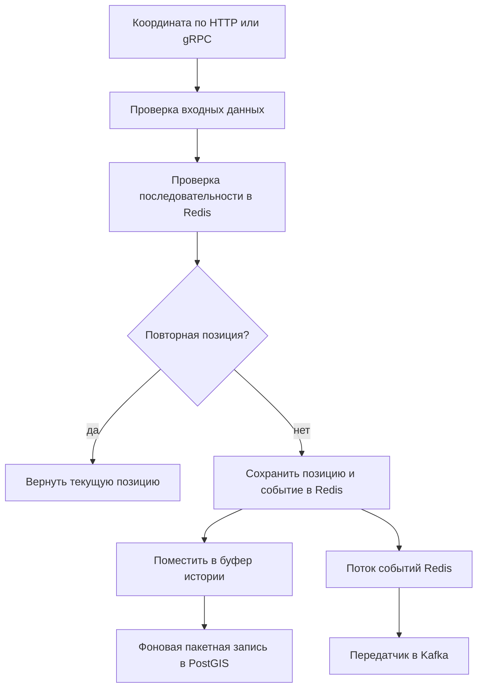

# Location Service

## Общее описание и общий принцип работы

`Location_Service` принимает координаты устройств бригад, хранит последнее
положение в Redis, пакетно переносит историю в PostGIS, ищет ближайшие бригады,
проверяет попадание точки в геозоны и обнаруживает потерю сигнала.

Последняя позиция записывается синхронно. Новая, не повторная позиция помещается
в ограниченный буфер истории; фоновый обработчик сохраняет пакеты в
`position_history`. Отказ буфера журналируется, но не отменяет уже принятую
текущую позицию. Изменение состояния сигнала и добавление события
`BrigadeSignalLost` в поток Redis выполняются репозиторием атомарно.

### Путь координаты

Отказ буфера журналируется и не отменяет сохраненную текущую позицию. Ветка
потока событий включается при наличии брокеров Kafka. Основные участки:
[`RecordPosition`](src/core/service/position_service.go),
[запись в Redis](src/core/repository/current_location_repo.go) и
[пакетный обработчик](src/infrastructure/positionhistory/worker.go).

## Модели

### Перечисления

| Тип | Значения | Назначение |
|---|---|---|
| `SubjectType` | `BRIGADE`, `VEHICLE`, `DEVICE` | Вид сущности для чтения текущей позиции. |
| `SignalStatus` | `ONLINE`, `STALE`, `OFFLINE` | Свежесть сигнала. |
| `SortOrder` | `asc`, `desc` | Порядок истории. |

### `Position`

| Поле | Тип Go | Назначение |
|---|---|---|
| `ID`, `EventID` | `uuid.UUID` | Запись позиции и исходное событие. |
| `DeviceID` | `string` | Передающее устройство. |
| `VehicleID`, `BrigadeID` | `uuid.UUID` | Машина и бригада. |
| `Sequence` | `uint64` | Возрастающий номер точки устройства. |
| `Latitude`, `Longitude` | `float64` | Широта и долгота. |
| `SpeedKMH` | `float64` | Скорость в километрах в час. |
| `Heading` | `float64` | Направление от 0 включительно до 360 исключительно. |
| `AccuracyMeters` | `float64` | Точность в метрах. |
| `AltitudeMeters` | `*float64` | Необязательная высота. |
| `Simulated` | `bool` | Признак данных имитатора. |
| `RecordedAt`, `ReceivedAt` | `time.Time` | Время измерения и приема. |

### Текущее положение и геозоны

| Структура | Поля и назначение |
|---|---|
| `CurrentLocation` | `Position` — последняя точка; `SignalStatus` — свежесть; `StaleAfter` — момент устаревания; `Duplicate` — внутренний признак повтора. |
| `GeoZone` | `ID` — зона; `DepartmentID` — подразделение; `Name` — название; `GeoJSON` — геометрия; `Active` — активность; `CreatedAt`, `UpdatedAt` — времена. |
| `NearbyBrigade` | `BrigadeID` — бригада; `Location` — текущее положение; `DistanceMeters` — расстояние до заданной точки. |
| `SignalChange` | `BrigadeID` — бригада; `From`, `To` — прежнее и новое состояния сигнала; `ChangedAt` — время изменения. |

### Входы и результаты позиций

| Структура | Поля и назначение |
|---|---|
| `RecordPositionInput` | `EventID`, `EventVersion`, `OccurredAt` — событие; `DeviceID`, `VehicleID`, `BrigadeID` — источник; `Sequence` — порядок; `Latitude`, `Longitude`, `SpeedKMH`, `Heading`, `AccuracyMeters`, `AltitudeMeters` — измерения; `Simulated` — имитированные данные. |
| `RecordPositionResult` | `Position` — принятая точка; `Duplicate` — была ли она уже обработана. |
| `GetCurrentLocationInput` | `SubjectType` — вид; `SubjectID` — строковый идентификатор. |
| `GetCurrentLocationResult` | `Location` — найденное текущее положение. |
| `GetCurrentLocationsInput` | `BrigadeIDs` — бригады; `AllowStale` — разрешить устаревшие позиции. |
| `GetCurrentLocationsResult` | `Locations` — карта бригада-позиция; `Missing` — идентификаторы без допустимой позиции. |
| `ListPositionHistoryInput` | `BrigadeID` — бригада; `From`, `To` — период; `Limit`, `Offset` — страница; `Order` — порядок. |
| `ListPositionHistoryResult` | `Positions` — страница точек; `Total` — общее число. |
| `FindNearbyBrigadesInput` | `Latitude`, `Longitude` — центр; `RadiusMeters` — радиус; `BrigadeIDs` — необязательное множество; `OnlyFresh` — только свежие; `FreshnessWindow` — окно свежести; `Limit` — предел. |
| `FindNearbyBrigadesResult` | `Brigades` — найденные бригады с расстояниями. |
| `DetectLostSignalsInput` | `StaleBefore` — граница устаревания; `OfflineBefore` — более ранняя граница отключения; `Limit` — пакет. |
| `DetectLostSignalsResult` | `Changes` — выполненные переходы состояния. |

### Входы и результаты геозон

| Структура | Поля и назначение |
|---|---|
| `CreateGeoZoneInput` | `DepartmentID` — подразделение; `Name` — название; `GeoJSON` — геометрия; `ActorRoles` — роли автора. |
| `CreateGeoZoneResult` | `Zone` — созданная зона. |
| `UpdateGeoZoneInput` | `ID` — зона; необязательные `Name`, `GeoJSON`, `Active`; `ActorRoles` — роли. |
| `UpdateGeoZoneResult` | `Zone` — измененная зона. |
| `DeleteGeoZoneInput` | `ID` — зона; `ActorRoles` — роли. |
| `DeleteGeoZoneResult` | `Zone` — состояние после удаления. |
| `ListGeoZonesInput` | Необязательные `DepartmentID`, `Active`; `Limit`, `Offset` — страница. |
| `ListGeoZonesResult` | `Zones` — страница; `Total` — общее число. |
| `CheckPointInZonesInput` | `Latitude`, `Longitude` — точка; `DepartmentID` — необязательное подразделение; `ZoneIDs` — необязательные конкретные зоны. |
| `CheckPointInZonesResult` | `Zones` — зоны, содержащие точку. |

Проверки требуют событие версии 1, положительную последовательность в диапазоне
`BIGINT`, координаты в географических пределах, неотрицательные скорость и
точность и направление `[0, 360)`. Страница допускает предел 0–1000;
репозиторий трактует 0 как значение по умолчанию. Для истории `From < To`.
Для потери сигнала `OfflineBefore < StaleBefore`, а граница устаревания не
может быть дальше чем на минуту в будущем.

## Функции

### `positionBuffer.Add`

Добавляет позицию в конец буфера под блокировкой. Если достигнута заданная вместимость, сообщает вызывающему коду, что пакет пора выгрузить.

### `positionBuffer.Len`

Под блокировкой возвращает текущее количество ожидающих позиций.

### `positionBuffer.TakeBatch`

Извлекает до заданного числа первых позиций, копирует их в отдельный срез и удаляет из очереди. Пустой или неположительный размер возвращает пустой результат.

### `positionBuffer.Prepend`

Возвращает неотправленный пакет в начало очереди, сохраняя его порядок перед более новыми позициями.

### Конструкторы позиций

`NewPositionServiceStruct` создает сервис без буфера истории.
`NewPositionServiceStructWithHistory` добавляет приемник истории.
`NewPositionServiceStructWithLogger` является полным конструктором и заменяет
пустой журнал на `zap.NewNop()`.

### `RecordPosition`

Проверяет вход, сохраняет текущую позицию в Redis через
`SaveCurrentLocation` и возвращает точку с признаком повтора. Только новую
точку добавляет в настроенный буфер истории. Переполнение буфера
`ErrPositionBufferFull` записывается как предупреждение, но не превращает
успешный прием текущей позиции в ошибку.

### `GetCurrentLocation` и `GetCurrentLocations`

Первый метод проверяет вид и идентификатор одной сущности. Второй требует
непустой список ненулевых UUID бригад и учитывает `AllowStale`. Оба передают
запрос репозиторию и добавляют имя операции к ошибке.

### `ListPositionHistory`

Проверяет бригаду, обязательный корректный период, порядок и страницу, затем
возвращает точки из PostGIS и общий счетчик.

### `FindNearbyBrigades`

Проверяет координаты, положительный радиус и предел до 1000. Репозиторий
выполняет пространственный поиск, может ограничить множество бригад и свежесть.

### `DetectLostSignals`

Проверяет временные границы и размер пакета, затем вызывает атомарную операцию
репозитория. При изменениях журналирует их количество. Возвращает только
фактически выполненные переходы.

### `validationError`

Оборачивает причину именем операции и `models.ErrValidation`, сохраняя
возможность распознавания через `errors.Is`.

### Конструкторы геозон

`NewGeoZoneServiceStruct` создает реализацию с пустым журналом.
`NewGeoZoneServiceStructWithLogger` принимает журнал и подставляет
`zap.NewNop()` для `nil`.

### `CreateGeoZone`

Требует подразделение, название, GeoJSON и роль управления. Репозиторий
проверяет и сохраняет геометрию PostGIS; сервис оборачивает ошибку и
журналирует созданный UUID.

### `UpdateGeoZone`

Требует UUID, хотя бы одно новое поле и право управления, затем выполняет
частичное обновление.

### `DeleteGeoZone`

Проверяет UUID и право и передает удаление репозиторию. Возвращает полную зону,
полученную от него.

### `ListGeoZones`

Проверяет страницу и возвращает зоны с общим количеством, учитывая
необязательные подразделение и активность.

### `CheckPointInZones`

Проверяет координаты и возвращает активные либо выбранные репозиторием зоны,
геометрия которых содержит точку.

### `canManageZones`

Нормализует каждую роль и разрешает `admin`, `system_admin` и
`dispatcher`.

### `NewMemoryPositionBuffer`

Создает защищенный мьютексом буфер. Неположительная емкость заменяется на
10 000.

### `MemoryPositionBuffer.Add`

Отклоняет `nil`, затем под блокировкой проверяет емкость и добавляет указатель
на позицию. При заполнении возвращает `ErrPositionBufferFull`.

### `MemoryPositionBuffer.TakeBatch`

Под блокировкой выбирает начало очереди. Неположительный или слишком большой
размер означает весь буфер. Возвращаемый срез копируется, извлеченные ссылки
очищаются, остаток сдвигается без сохранения удаленных указателей.

### `MemoryPositionBuffer.Prepend`

Добавляет пакет в начало перед уже накопленными элементами. Используется для
возврата пакета после ошибки записи истории. Пустой пакет ничего не меняет.

### `MemoryPositionBuffer.Len`

Возвращает текущую длину под тем же мьютексом.

### Конструкторы общего сервиса

`NewService` создает сервис без истории, `NewServiceWithPositionHistory` —
с приемником истории, `NewServiceWithLogger` — полный вариант. Последний
создает обе реализации, позиций и геозон, с общим репозиторием и журналом.

## Структура БД

### `position_history` — история координат

| Поле | Тип PostgreSQL | Назначение |
|---|---|---|
| `id`, `event_id` | `UUID` | Запись и исходное событие. |
| `device_id` | `VARCHAR(128)` | Непустое устройство. |
| `vehicle_id`, `brigade_id` | `UUID` | Машина и бригада. |
| `sequence` | `BIGINT` | Положительный номер. |
| `latitude`, `longitude` | `DOUBLE PRECISION` | Проверенные координаты. |
| `position` | `GEOGRAPHY(POINT, 4326)` | Автоматически вычисляемая и хранимая точка. |
| `speed_kmh`, `heading`, `accuracy_meters` | `DOUBLE PRECISION` | Скорость, направление и точность с проверками. |
| `altitude_meters` | `DOUBLE PRECISION` | Необязательная высота. |
| `simulated` | `BOOLEAN` | Признак имитации. |
| `recorded_at`, `received_at` | `TIMESTAMPTZ` | Время измерения и приема. |

Составной первичный ключ — `(recorded_at, id)`. Таблица разбита по
`recorded_at`; функция `ensure_position_history_partitions` создает
месячные разделы вперед. Уникальные индексы ограничивают событие и
последовательность устройства внутри ключа разделения; GiST-индекс обслуживает
пространственный поиск.

### `position_history_default` — запасной раздел

Раздел `DEFAULT` таблицы `position_history`. Он принимает строки, для
которых еще нет подходящего месячного раздела. Собственных дополнительных
полей не имеет и наследует следующую структуру родительской таблицы.

| Поле | Тип PostgreSQL | Назначение |
|---|---|---|
| `id` | `UUID` | Идентификатор измерения. |
| `subject_type` | `VARCHAR(32)` | Вид отслеживаемого субъекта. |
| `subject_id` | `UUID` | Идентификатор субъекта. |
| `device_id` | `VARCHAR(128)` | Идентификатор устройства-источника. |
| `sequence` | `BIGINT` | Положительный порядковый номер сообщения устройства. |
| `latitude` | `DOUBLE PRECISION` | Широта в диапазоне от -90 до 90. |
| `longitude` | `DOUBLE PRECISION` | Долгота в диапазоне от -180 до 180. |
| `position` | `GEOGRAPHY(POINT, 4326)` | Вычисляемая и сохраняемая географическая точка. |
| `speed_kmh` | `DOUBLE PRECISION` | Неотрицательная скорость в километрах в час. |
| `heading` | `DOUBLE PRECISION` | Направление движения от 0 включительно до 360 исключительно. |
| `accuracy_meters` | `DOUBLE PRECISION` | Неотрицательная точность координат в метрах. |
| `altitude_meters` | `DOUBLE PRECISION` | Необязательная высота в метрах. |
| `simulated` | `BOOLEAN` | Признак сгенерированного, а не полученного от устройства измерения. |
| `recorded_at` | `TIMESTAMPTZ` | Время измерения; входит в составной первичный ключ. |
| `received_at` | `TIMESTAMPTZ` | Время приема измерения сервисом. |

### `geo_zones` — географические зоны

| Поле | Тип PostgreSQL | Назначение |
|---|---|---|
| `id` | `UUID` | Первичный ключ. |
| `department_id` | `UUID` | Подразделение. |
| `name` | `VARCHAR(255)` | Непустое название. |
| `zone` | `GEOGRAPHY(GEOMETRY, 4326)` | Допустимый полигон или мультиполигон. |
| `active` | `BOOLEAN` | Активность. |
| `created_at`, `updated_at` | `TIMESTAMPTZ` | Времена записи. |

База проверяет тип и геометрическую корректность. У активной зоны название
уникально внутри подразделения без учета регистра. Созданы индексы по
подразделению, активности и геометрии.
