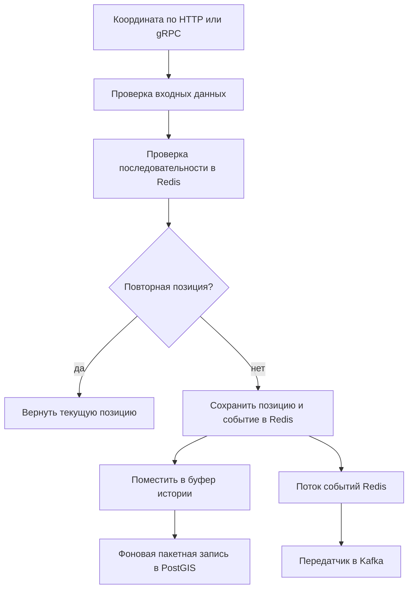

# Сервис местоположения (Location Service)

## Общее описание и общий принцип работы

`Location_Service` принимает координаты устройств бригад, хранит последнее
положение в Redis, пакетно переносит историю в PostGIS, ищет ближайшие бригады,
проверяет попадание точки в геозоны и обнаруживает потерю сигнала.

Последняя позиция записывается синхронно. Новая, не повторная позиция помещается
в ограниченный буфер истории; фоновый обработчик сохраняет пакеты в
`position_history`. Отказ буфера журналируется, но не отменяет уже принятую
текущую позицию. Изменение состояния сигнала и добавление события
`BrigadeSignalLost` в поток Redis выполняются репозиторием атомарно.

### Путь координаты



Отказ буфера журналируется и не отменяет сохраненную текущую позицию. Ветка
потока событий включается при наличии брокеров Kafka. Основные участки:
[`RecordPosition`](src/core/service/position_service.go),
[запись в Redis](src/core/repository/current_location_repo.go) и
[пакетный обработчик](src/infrastructure/positionhistory/worker.go).

## Модели

### Перечисления

| Тип | Значения | Назначение |
|---|---|---|
| `SubjectType` | `BRIGADE`, `VEHICLE`, `DEVICE` | Вид сущности для чтения текущей позиции. |
| `SignalStatus` | `ONLINE`, `STALE`, `OFFLINE` | Свежесть сигнала. |
| `SortOrder` | `asc`, `desc` | Порядок истории. |

### `Position`

| Поле | Тип Go | Назначение |
|---|---|---|
| `ID`, `EventID` | `uuid.UUID` | Запись позиции и исходное событие. |
| `DeviceID` | `string` | Передающее устройство. |
| `VehicleID`, `BrigadeID` | `uuid.UUID` | Машина и бригада. |
| `Sequence` | `uint64` | Возрастающий номер точки устройства. |
| `Latitude`, `Longitude` | `float64` | Широта и долгота. |
| `SpeedKMH` | `float64` | Скорость в километрах в час. |
| `Heading` | `float64` | Направление от 0 включительно до 360 исключительно. |
| `AccuracyMeters` | `float64` | Точность в метрах. |
| `AltitudeMeters` | `*float64` | Необязательная высота. |
| `Simulated` | `bool` | Признак данных имитатора. |
| `RecordedAt`, `ReceivedAt` | `time.Time` | Время измерения и приема. |

### Текущее положение и геозоны

| Структура | Поля и назначение |
|---|---|
| `CurrentLocation` | `Position` — последняя точка; `SignalStatus` — свежесть; `StaleAfter` — момент устаревания; `Duplicate` — внутренний признак повтора. |
| `GeoZone` | `ID` — зона; `DepartmentID` — подразделение; `Name` — название; `GeoJSON` — геометрия; `Active` — активность; `CreatedAt`, `UpdatedAt` — времена. |
| `NearbyBrigade` | `BrigadeID` — бригада; `Location` — текущее положение; `DistanceMeters` — расстояние до заданной точки. |
| `SignalChange` | `BrigadeID` — бригада; `From`, `To` — прежнее и новое состояния сигнала; `ChangedAt` — время изменения. |

### Входы и результаты позиций

| Структура | Поля и назначение |
|---|---|
| `RecordPositionInput` | `EventID`, `EventVersion`, `OccurredAt` — событие; `DeviceID`, `VehicleID`, `BrigadeID` — источник; `Sequence` — порядок; `Latitude`, `Longitude`, `SpeedKMH`, `Heading`, `AccuracyMeters`, `AltitudeMeters` — измерения; `Simulated` — имитированные данные. |
| `RecordPositionResult` | `Position` — принятая точка; `Duplicate` — была ли она уже обработана. |
| `GetCurrentLocationInput` | `SubjectType` — вид; `SubjectID` — строковый идентификатор. |
| `GetCurrentLocationResult` | `Location` — найденное текущее положение. |
| `GetCurrentLocationsInput` | `BrigadeIDs` — бригады; `AllowStale` — разрешить устаревшие позиции. |
| `GetCurrentLocationsResult` | `Locations` — карта бригада-позиция; `Missing` — идентификаторы без допустимой позиции. |
| `ListPositionHistoryInput` | `BrigadeID` — бригада; `From`, `To` — период; `Limit`, `Offset` — страница; `Order` — порядок. |
| `ListPositionHistoryResult` | `Positions` — страница точек; `Total` — общее число. |
| `FindNearbyBrigadesInput` | `Latitude`, `Longitude` — центр; `RadiusMeters` — радиус; `BrigadeIDs` — необязательное множество; `OnlyFresh` — только свежие; `FreshnessWindow` — окно свежести; `Limit` — предел. |
| `FindNearbyBrigadesResult` | `Brigades` — найденные бригады с расстояниями. |
| `DetectLostSignalsInput` | `StaleBefore` — граница устаревания; `OfflineBefore` — более ранняя граница отключения; `Limit` — пакет. |
| `DetectLostSignalsResult` | `Changes` — выполненные переходы состояния. |

### Входы и результаты геозон

| Структура | Поля и назначение |
|---|---|
| `CreateGeoZoneInput` | `DepartmentID` — подразделение; `Name` — название; `GeoJSON` — геометрия; `ActorRoles` — роли автора. |
| `CreateGeoZoneResult` | `Zone` — созданная зона. |
| `UpdateGeoZoneInput` | `ID` — зона; необязательные `Name`, `GeoJSON`, `Active`; `ActorRoles` — роли. |
| `UpdateGeoZoneResult` | `Zone` — измененная зона. |
| `DeleteGeoZoneInput` | `ID` — зона; `ActorRoles` — роли. |
| `DeleteGeoZoneResult` | `Zone` — состояние после удаления. |
| `ListGeoZonesInput` | Необязательные `DepartmentID`, `Active`; `Limit`, `Offset` — страница. |
| `ListGeoZonesResult` | `Zones` — страница; `Total` — общее число. |
| `CheckPointInZonesInput` | `Latitude`, `Longitude` — точка; `DepartmentID` — необязательное подразделение; `ZoneIDs` — необязательные конкретные зоны. |
| `CheckPointInZonesResult` | `Zones` — зоны, содержащие точку. |

Проверки требуют событие версии 1, положительную последовательность в диапазоне
`BIGINT`, координаты в географических пределах, неотрицательные скорость и
точность и направление `[0, 360)`. Страница допускает предел 0–1000;
репозиторий трактует 0 как значение по умолчанию. Для истории `From < To`.
Для потери сигнала `OfflineBefore < StaleBefore`, а граница устаревания не
может быть дальше чем на минуту в будущем.

## Функции

Имя функции открывает её реализацию в ветке `test`; структуры параметров и результатов описаны в конце README.

### func (*PositionServiceStruct) [RecordPosition](https://github.com/FIZZI-77/automatic_system/blob/test/Location_Service/src/core/service/position_service.go#L46)

```go
func (s *PositionServiceStruct) RecordPosition(
    ctx context.Context,
    in *models.RecordPositionInput,
) (*models.RecordPositionResult, error)
```

Типы: [PositionServiceStruct](#type-positionservicestruct), [RecordPositionInput](#type-recordpositioninput), [RecordPositionResult](#type-recordpositionresult).

Структуры: [RecordPositionInput](#type-recordpositioninput), [RecordPositionResult](#type-recordpositionresult).

Проверяет вход, сохраняет текущую позицию в Redis через
`SaveCurrentLocation` и возвращает точку с признаком повтора. Только новую
точку добавляет в настроенный буфер истории. Переполнение буфера
`ErrPositionBufferFull` записывается как предупреждение, но не превращает
успешный прием текущей позиции в ошибку.

### func (*PositionServiceStruct) [GetCurrentLocation](https://github.com/FIZZI-77/automatic_system/blob/test/Location_Service/src/core/service/position_service.go#L78)

```go
func (s *PositionServiceStruct) GetCurrentLocation(
    ctx context.Context,
    in *models.GetCurrentLocationInput,
) (*models.GetCurrentLocationResult, error)
```

Типы: [GetCurrentLocationInput](#type-getcurrentlocationinput), [GetCurrentLocationResult](#type-getcurrentlocationresult), [PositionServiceStruct](#type-positionservicestruct).

Структуры: [GetCurrentLocationInput](#type-getcurrentlocationinput), [GetCurrentLocationResult](#type-getcurrentlocationresult).

Первый метод проверяет вид и идентификатор одной сущности. Второй требует
непустой список ненулевых UUID бригад и учитывает `AllowStale`. Оба передают
запрос репозиторию и добавляют имя операции к ошибке.

### func (*PositionServiceStruct) [GetCurrentLocations](https://github.com/FIZZI-77/automatic_system/blob/test/Location_Service/src/core/service/position_service.go#L92)

```go
func (s *PositionServiceStruct) GetCurrentLocations(
    ctx context.Context,
    in *models.GetCurrentLocationsInput,
) (*models.GetCurrentLocationsResult, error)
```

Типы: [GetCurrentLocationsInput](#type-getcurrentlocationsinput), [GetCurrentLocationsResult](#type-getcurrentlocationsresult), [PositionServiceStruct](#type-positionservicestruct).

Структуры: [GetCurrentLocationsInput](#type-getcurrentlocationsinput), [GetCurrentLocationsResult](#type-getcurrentlocationsresult).

Первый метод проверяет вид и идентификатор одной сущности. Второй требует
непустой список ненулевых UUID бригад и учитывает `AllowStale`. Оба передают
запрос репозиторию и добавляют имя операции к ошибке.

### func (*PositionServiceStruct) [ListPositionHistory](https://github.com/FIZZI-77/automatic_system/blob/test/Location_Service/src/core/service/position_service.go#L106)

```go
func (s *PositionServiceStruct) ListPositionHistory(
    ctx context.Context,
    in *models.ListPositionHistoryInput,
) (*models.ListPositionHistoryResult, error)
```

Типы: [ListPositionHistoryInput](#type-listpositionhistoryinput), [ListPositionHistoryResult](#type-listpositionhistoryresult), [PositionServiceStruct](#type-positionservicestruct).

Структуры: [ListPositionHistoryInput](#type-listpositionhistoryinput), [ListPositionHistoryResult](#type-listpositionhistoryresult).

Проверяет бригаду, обязательный корректный период, порядок и страницу, затем
возвращает точки из PostGIS и общий счетчик.

### func (*PositionServiceStruct) [FindNearbyBrigades](https://github.com/FIZZI-77/automatic_system/blob/test/Location_Service/src/core/service/position_service.go#L120)

```go
func (s *PositionServiceStruct) FindNearbyBrigades(
    ctx context.Context,
    in *models.FindNearbyBrigadesInput,
) (*models.FindNearbyBrigadesResult, error)
```

Типы: [FindNearbyBrigadesInput](#type-findnearbybrigadesinput), [FindNearbyBrigadesResult](#type-findnearbybrigadesresult), [PositionServiceStruct](#type-positionservicestruct).

Структуры: [FindNearbyBrigadesInput](#type-findnearbybrigadesinput), [FindNearbyBrigadesResult](#type-findnearbybrigadesresult).

Проверяет координаты, положительный радиус и предел до 1000. Репозиторий
выполняет пространственный поиск, может ограничить множество бригад и свежесть.

### func (*PositionServiceStruct) [DetectLostSignals](https://github.com/FIZZI-77/automatic_system/blob/test/Location_Service/src/core/service/position_service.go#L134)

```go
func (s *PositionServiceStruct) DetectLostSignals(
    ctx context.Context,
    in *models.DetectLostSignalsInput,
) (*models.DetectLostSignalsResult, error)
```

Типы: [DetectLostSignalsInput](#type-detectlostsignalsinput), [DetectLostSignalsResult](#type-detectlostsignalsresult), [PositionServiceStruct](#type-positionservicestruct).

Структуры: [DetectLostSignalsInput](#type-detectlostsignalsinput).

Проверяет временные границы и размер пакета, затем вызывает атомарную операцию
репозитория. При изменениях журналирует их количество. Возвращает только
фактически выполненные переходы.

### func [validationError](https://github.com/FIZZI-77/automatic_system/blob/test/Location_Service/src/core/service/position_service.go#L153)

```go
func validationError(operation string, err error) error
```

Оборачивает причину именем операции и `models.ErrValidation`, сохраняя
возможность распознавания через `errors.Is`.

### func (*GeoZoneServiceStruct) [CreateGeoZone](https://github.com/FIZZI-77/automatic_system/blob/test/Location_Service/src/core/service/geo_zone_service.go#L34)

```go
func (s *GeoZoneServiceStruct) CreateGeoZone(
    ctx context.Context,
    in *models.CreateGeoZoneInput,
) (*models.CreateGeoZoneResult, error)
```

Типы: [CreateGeoZoneInput](#type-creategeozoneinput), [CreateGeoZoneResult](#type-creategeozoneresult), [GeoZoneServiceStruct](#type-geozoneservicestruct).

Структуры: [CreateGeoZoneInput](#type-creategeozoneinput), [CreateGeoZoneResult](#type-creategeozoneresult).

Требует подразделение, название, GeoJSON и роль управления. Репозиторий
проверяет и сохраняет геометрию PostGIS; сервис оборачивает ошибку и
журналирует созданный UUID.

### func (*GeoZoneServiceStruct) [UpdateGeoZone](https://github.com/FIZZI-77/automatic_system/blob/test/Location_Service/src/core/service/geo_zone_service.go#L55)

```go
func (s *GeoZoneServiceStruct) UpdateGeoZone(
    ctx context.Context,
    in *models.UpdateGeoZoneInput,
) (*models.UpdateGeoZoneResult, error)
```

Типы: [GeoZoneServiceStruct](#type-geozoneservicestruct), [UpdateGeoZoneInput](#type-updategeozoneinput), [UpdateGeoZoneResult](#type-updategeozoneresult).

Структуры: [UpdateGeoZoneInput](#type-updategeozoneinput), [UpdateGeoZoneResult](#type-updategeozoneresult).

Требует UUID, хотя бы одно новое поле и право управления, затем выполняет
частичное обновление.

### func (*GeoZoneServiceStruct) [DeleteGeoZone](https://github.com/FIZZI-77/automatic_system/blob/test/Location_Service/src/core/service/geo_zone_service.go#L72)

```go
func (s *GeoZoneServiceStruct) DeleteGeoZone(
    ctx context.Context,
    in *models.DeleteGeoZoneInput,
) (*models.DeleteGeoZoneResult, error)
```

Типы: [DeleteGeoZoneInput](#type-deletegeozoneinput), [DeleteGeoZoneResult](#type-deletegeozoneresult), [GeoZoneServiceStruct](#type-geozoneservicestruct).

Структуры: [DeleteGeoZoneInput](#type-deletegeozoneinput), [DeleteGeoZoneResult](#type-deletegeozoneresult).

Проверяет UUID и право и передает удаление репозиторию. Возвращает полную зону,
полученную от него.

### func (*GeoZoneServiceStruct) [ListGeoZones](https://github.com/FIZZI-77/automatic_system/blob/test/Location_Service/src/core/service/geo_zone_service.go#L89)

```go
func (s *GeoZoneServiceStruct) ListGeoZones(
    ctx context.Context,
    in *models.ListGeoZonesInput,
) (*models.ListGeoZonesResult, error)
```

Типы: [GeoZoneServiceStruct](#type-geozoneservicestruct), [ListGeoZonesInput](#type-listgeozonesinput), [ListGeoZonesResult](#type-listgeozonesresult).

Структуры: [ListGeoZonesInput](#type-listgeozonesinput), [ListGeoZonesResult](#type-listgeozonesresult).

Проверяет страницу и возвращает зоны с общим количеством, учитывая
необязательные подразделение и активность.

### func (*GeoZoneServiceStruct) [CheckPointInZones](https://github.com/FIZZI-77/automatic_system/blob/test/Location_Service/src/core/service/geo_zone_service.go#L103)

```go
func (s *GeoZoneServiceStruct) CheckPointInZones(
    ctx context.Context,
    in *models.CheckPointInZonesInput,
) (*models.CheckPointInZonesResult, error)
```

Типы: [CheckPointInZonesInput](#type-checkpointinzonesinput), [CheckPointInZonesResult](#type-checkpointinzonesresult), [GeoZoneServiceStruct](#type-geozoneservicestruct).

Структуры: [CheckPointInZonesInput](#type-checkpointinzonesinput), [CheckPointInZonesResult](#type-checkpointinzonesresult).

Проверяет координаты и возвращает активные либо выбранные репозиторием зоны,
геометрия которых содержит точку.

### func [canManageZones](https://github.com/FIZZI-77/automatic_system/blob/test/Location_Service/src/core/service/geo_zone_service.go#L117)

```go
func canManageZones(roles []string) bool
```

Нормализует каждую роль и разрешает `admin`, `system_admin` и
`dispatcher`.

### func [NewMemoryPositionBuffer](https://github.com/FIZZI-77/automatic_system/blob/test/Location_Service/src/core/service/position_buffer.go#L22)

```go
func NewMemoryPositionBuffer(capacity int) *MemoryPositionBuffer
```

Типы: [MemoryPositionBuffer](#type-memorypositionbuffer).

Структуры: [MemoryPositionBuffer](#type-memorypositionbuffer).

Создает защищенный мьютексом буфер. Неположительная емкость заменяется на
10 000.

### func (*Worker) [Add](https://github.com/FIZZI-77/automatic_system/blob/test/Location_Service/src/infrastructure/positionhistory/worker.go#L72)

```go
func (w *Worker) Add(position *models.Position) error
```

Типы: [Position](#type-position), [Worker](#type-worker).

Добавляет позицию в конец буфера под блокировкой. Если достигнута заданная вместимость, сообщает вызывающему коду, что пакет пора выгрузить.


### func (*MemoryPositionBuffer) [Add](https://github.com/FIZZI-77/automatic_system/blob/test/Location_Service/src/core/service/position_buffer.go#L29)

```go
func (b *MemoryPositionBuffer) Add(position *models.Position) error
```

Типы: [MemoryPositionBuffer](#type-memorypositionbuffer), [Position](#type-position).

Добавляет позицию в конец буфера под блокировкой. Если достигнута заданная вместимость, сообщает вызывающему коду, что пакет пора выгрузить.


### func (*Closer) [Add](https://github.com/FIZZI-77/automatic_system/blob/test/Location_Service/pkg/closer/closer.go#L22)

```go
func (c *Closer) Add(name string, fn func() error)
```

Типы: [Closer](#type-closer).

Добавляет позицию в конец буфера под блокировкой. Если достигнута заданная вместимость, сообщает вызывающему коду, что пакет пора выгрузить.


### func (*MemoryPositionBuffer) [Len](https://github.com/FIZZI-77/automatic_system/blob/test/Location_Service/src/core/service/position_buffer.go#L69)

```go
func (b *MemoryPositionBuffer) Len() int
```

Типы: [MemoryPositionBuffer](#type-memorypositionbuffer).

Под блокировкой возвращает текущее количество ожидающих позиций.


### func (*MemoryPositionBuffer) [TakeBatch](https://github.com/FIZZI-77/automatic_system/blob/test/Location_Service/src/core/service/position_buffer.go#L42)

```go
func (b *MemoryPositionBuffer) TakeBatch(maxSize int) []*models.Position
```

Типы: [MemoryPositionBuffer](#type-memorypositionbuffer), [Position](#type-position).

Извлекает до заданного числа первых позиций, копирует их в отдельный срез и удаляет из очереди. Пустой или неположительный размер возвращает пустой результат.


### func (*MemoryPositionBuffer) [Prepend](https://github.com/FIZZI-77/automatic_system/blob/test/Location_Service/src/core/service/position_buffer.go#L57)

```go
func (b *MemoryPositionBuffer) Prepend(batch []*models.Position)
```

Типы: [MemoryPositionBuffer](#type-memorypositionbuffer), [Position](#type-position).

Возвращает неотправленный пакет в начало очереди, сохраняя его порядок перед более новыми позициями.


## Группы обработчиков

### Конструкторы позиций

`NewPositionServiceStruct` создает сервис без буфера истории.
`NewPositionServiceStructWithHistory` добавляет приемник истории.
`NewPositionServiceStructWithLogger` является полным конструктором и заменяет
пустой журнал на `zap.NewNop()`.

### Конструкторы геозон

`NewGeoZoneServiceStruct` создает реализацию с пустым журналом.
`NewGeoZoneServiceStructWithLogger` принимает журнал и подставляет
`zap.NewNop()` для `nil`.

### Конструкторы общего сервиса

`NewService` создает сервис без истории, `NewServiceWithPositionHistory` —
с приемником истории, `NewServiceWithLogger` — полный вариант. Последний
создает обе реализации, позиций и геозон, с общим репозиторием и журналом.

## Структура БД

### `position_history` — история координат

| Поле | Тип PostgreSQL | Назначение |
|---|---|---|
| `id`, `event_id` | `UUID` | Запись и исходное событие. |
| `device_id` | `VARCHAR(128)` | Непустое устройство. |
| `vehicle_id`, `brigade_id` | `UUID` | Машина и бригада. |
| `sequence` | `BIGINT` | Положительный номер. |
| `latitude`, `longitude` | `DOUBLE PRECISION` | Проверенные координаты. |
| `position` | `GEOGRAPHY(POINT, 4326)` | Автоматически вычисляемая и хранимая точка. |
| `speed_kmh`, `heading`, `accuracy_meters` | `DOUBLE PRECISION` | Скорость, направление и точность с проверками. |
| `altitude_meters` | `DOUBLE PRECISION` | Необязательная высота. |
| `simulated` | `BOOLEAN` | Признак имитации. |
| `recorded_at`, `received_at` | `TIMESTAMPTZ` | Время измерения и приема. |

Составной первичный ключ — `(recorded_at, id)`. Таблица разбита по
`recorded_at`; функция `ensure_position_history_partitions` создает
месячные разделы вперед. Уникальные индексы ограничивают событие и
последовательность устройства внутри ключа разделения; GiST-индекс обслуживает
пространственный поиск.

### `position_history_default` — запасной раздел

Раздел `DEFAULT` таблицы `position_history`. Он принимает строки, для
которых еще нет подходящего месячного раздела. Собственных дополнительных
полей не имеет и наследует следующую структуру родительской таблицы.

| Поле | Тип PostgreSQL | Назначение |
|---|---|---|
| `id` | `UUID` | Идентификатор измерения. |
| `subject_type` | `VARCHAR(32)` | Вид отслеживаемого субъекта. |
| `subject_id` | `UUID` | Идентификатор субъекта. |
| `device_id` | `VARCHAR(128)` | Идентификатор устройства-источника. |
| `sequence` | `BIGINT` | Положительный порядковый номер сообщения устройства. |
| `latitude` | `DOUBLE PRECISION` | Широта в диапазоне от -90 до 90. |
| `longitude` | `DOUBLE PRECISION` | Долгота в диапазоне от -180 до 180. |
| `position` | `GEOGRAPHY(POINT, 4326)` | Вычисляемая и сохраняемая географическая точка. |
| `speed_kmh` | `DOUBLE PRECISION` | Неотрицательная скорость в километрах в час. |
| `heading` | `DOUBLE PRECISION` | Направление движения от 0 включительно до 360 исключительно. |
| `accuracy_meters` | `DOUBLE PRECISION` | Неотрицательная точность координат в метрах. |
| `altitude_meters` | `DOUBLE PRECISION` | Необязательная высота в метрах. |
| `simulated` | `BOOLEAN` | Признак сгенерированного, а не полученного от устройства измерения. |
| `recorded_at` | `TIMESTAMPTZ` | Время измерения; входит в составной первичный ключ. |
| `received_at` | `TIMESTAMPTZ` | Время приема измерения сервисом. |

### `geo_zones` — географические зоны

| Поле | Тип PostgreSQL | Назначение |
|---|---|---|
| `id` | `UUID` | Первичный ключ. |
| `department_id` | `UUID` | Подразделение. |
| `name` | `VARCHAR(255)` | Непустое название. |
| `zone` | `GEOGRAPHY(GEOMETRY, 4326)` | Допустимый полигон или мультиполигон. |
| `active` | `BOOLEAN` | Активность. |
| `created_at`, `updated_at` | `TIMESTAMPTZ` | Времена записи. |

База проверяет тип и геометрическую корректность. У активной зоны название
уникально внутри подразделения без учета регистра. Созданы индексы по
подразделению, активности и геометрии.

## Структуры параметров и результатов

### type CheckPointInZonesInput

```go
type CheckPointInZonesInput struct {
	Latitude     float64
	Longitude    float64
	DepartmentID *uuid.UUID
	ZoneIDs      []uuid.UUID
}
```

### type CheckPointInZonesResult

```go
type CheckPointInZonesResult struct{ Zones []*GeoZone }
```

### type Closer

```go
type Closer struct {
	mu    sync.Mutex
	once  sync.Once
	items []item
	err   error
}
```

### type CreateGeoZoneInput

```go
type CreateGeoZoneInput struct {
	DepartmentID uuid.UUID
	Name         string
	GeoJSON      string
	ActorRoles   []string
}
```

### type CreateGeoZoneResult

```go
type CreateGeoZoneResult struct{ Zone *GeoZone }
```

### type DeleteGeoZoneInput

```go
type DeleteGeoZoneInput struct {
	ID         uuid.UUID
	ActorRoles []string
}
```

### type DeleteGeoZoneResult

```go
type DeleteGeoZoneResult struct{ Zone *GeoZone }
```

### type DetectLostSignalsInput

```go
type DetectLostSignalsInput struct {
	StaleBefore   time.Time
	OfflineBefore time.Time
	Limit         int32
}
```

### type DetectLostSignalsResult

```go
type DetectLostSignalsResult struct{ Changes []*SignalChange }
```

### type FindNearbyBrigadesInput

```go
type FindNearbyBrigadesInput struct {
	Latitude        float64
	Longitude       float64
	RadiusMeters    float64
	BrigadeIDs      []uuid.UUID
	OnlyFresh       bool
	FreshnessWindow time.Duration
	Limit           int32
}
```

### type FindNearbyBrigadesResult

```go
type FindNearbyBrigadesResult struct{ Brigades []*NearbyBrigade }
```

### type GeoZoneServiceStruct

```go
type GeoZoneServiceStruct struct {
	repo *repository.Repository
	log  *zap.Logger
}
```

### type GetCurrentLocationInput

```go
type GetCurrentLocationInput struct {
	SubjectType SubjectType
	SubjectID   string
}
```

### type GetCurrentLocationResult

```go
type GetCurrentLocationResult struct{ Location *CurrentLocation }
```

### type GetCurrentLocationsInput

```go
type GetCurrentLocationsInput struct {
	BrigadeIDs []uuid.UUID
	AllowStale bool
}
```

### type GetCurrentLocationsResult

```go
type GetCurrentLocationsResult struct {
	Locations map[uuid.UUID]*CurrentLocation
	Missing   []uuid.UUID
}
```

### type ListGeoZonesInput

```go
type ListGeoZonesInput struct {
	DepartmentID *uuid.UUID
	Active       *bool
	Limit        int32
	Offset       int32
}
```

### type ListGeoZonesResult

```go
type ListGeoZonesResult struct {
	Zones []*GeoZone
	Total int64
}
```

### type ListPositionHistoryInput

```go
type ListPositionHistoryInput struct {
	BrigadeID uuid.UUID
	From      time.Time
	To        time.Time
	Limit     int32
	Offset    int32
	Order     SortOrder
}
```

### type ListPositionHistoryResult

```go
type ListPositionHistoryResult struct {
	Positions []*Position
	Total     int64
}
```

### type MemoryPositionBuffer

```go
type MemoryPositionBuffer struct {
	mu       sync.Mutex
	items    []*models.Position
	capacity int
}
```

### type Position

```go
type Position struct {
	ID             uuid.UUID `json:"id"`
	EventID        uuid.UUID `json:"event_id"`
	DeviceID       string    `json:"device_id"`
	VehicleID      uuid.UUID `json:"vehicle_id"`
	BrigadeID      uuid.UUID `json:"brigade_id"`
	Sequence       uint64    `json:"sequence"`
	Latitude       float64   `json:"latitude"`
	Longitude      float64   `json:"longitude"`
	SpeedKMH       float64   `json:"speed_kmh"`
	Heading        float64   `json:"heading"`
	AccuracyMeters float64   `json:"accuracy_meters"`
	AltitudeMeters *float64  `json:"altitude_meters,omitempty"`
	Simulated      bool      `json:"simulated"`
	RecordedAt     time.Time `json:"recorded_at"`
	ReceivedAt     time.Time `json:"received_at"`
}
```

### type PositionServiceStruct

```go
type PositionServiceStruct struct {
	repo    *repository.Repository
	history PositionHistorySink
	log     *zap.Logger
}
```

### type RecordPositionInput

```go
type RecordPositionInput struct {
	EventID        uuid.UUID
	EventVersion   int32
	OccurredAt     time.Time
	DeviceID       string
	VehicleID      uuid.UUID
	BrigadeID      uuid.UUID
	Sequence       uint64
	Latitude       float64
	Longitude      float64
	SpeedKMH       float64
	Heading        float64
	AccuracyMeters float64
	AltitudeMeters *float64
	Simulated      bool
}
```

### type RecordPositionResult

```go
type RecordPositionResult struct {
	Position  *Position
	Duplicate bool
}
```

### type UpdateGeoZoneInput

```go
type UpdateGeoZoneInput struct {
	ID         uuid.UUID
	Name       *string
	GeoJSON    *string
	Active     *bool
	ActorRoles []string
}
```

### type UpdateGeoZoneResult

```go
type UpdateGeoZoneResult struct{ Zone *GeoZone }
```

### type Worker

```go
type Worker struct {
	db     *pgxpool.Pool
	cfg    Config
	logger *zap.Logger
}
```
