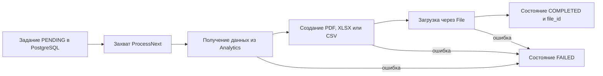

# Report Service

## Общее описание и общий принцип работы

`Report_Service` ставит в очередь и формирует документы PDF, XLSX и CSV по
данным `Analytics_Service`. PostgreSQL хранит состояние задания и исходящие
события. Готовый документ передается `File_Service`, который сохраняет его в
S3 и возвращает `file_id`.

Обычный путь задания:
`PENDING -> PROCESSING -> COMPLETED`. Ошибка дает `FAILED`, отмена —
`CANCELED`. Обработчик `ProcessNext` захватывает одну ожидающую запись через
репозиторий; запрос базы использует `FOR UPDATE SKIP LOCKED`, поэтому несколько
экземпляров могут разбирать очередь без двойного захвата.

### Очередь аналитических отчетов

Это очередь аналитических документов. Итоговый отчет о выполненных работах
обрабатывается отдельно из события заявки; его путь показан в
[Ticket Service](../Ticket_Service/README.md#формирование-итогового-отчета).
Этапы очереди реализованы в
[`ProcessNext`](src/core/service/report_service.go).

## Модели

### Перечисления

| Тип | Значения | Назначение |
|---|---|---|
| `Type` | `TICKET_OVERVIEW`, `SLA_SUMMARY`, `TICKET_BREAKDOWN`, `DAILY_TICKETS` | Состав данных документа. |
| `Format` | `PDF`, `XLSX`, `CSV` | Формат готового файла. |
| `Status` | `PENDING`, `PROCESSING`, `COMPLETED`, `FAILED`, `CANCELED` | Состояние задания. |

### Основные структуры

| Структура | Поля и назначение |
|---|---|
| `Filter` | `From`, `To` — границы периода; `DepartmentID` — подразделение; `CategoryID` — категория; `Priority` — приоритет. Все поля необязательны. |
| `Report` | `ID` — задание; `RequestedBy` — заказавший пользователь; `Name` — имя документа; `Type` — состав; `Format` — формат; `Status` — состояние; `Filter` — отбор аналитики; `ActorRoles` — роли заказчика, сохраненные на момент создания; `FileID` — готовый файл; `Error` — ошибка; `Attempts` — попытки; `CreatedAt`, `UpdatedAt` — времена; `CompletedAt` — завершение. |
| `CreateInput` | `RequestedBy` — заказчик; `Name` — имя; `Type` — вид отчета; `Format` — формат; `Filter` — отбор; `ActorRoles` — роли для чтения исходных данных и файла. |
| `ListFilter` | `RequestedBy` — необязательный заказчик; `Status` — состояние; `Limit` — размер страницы; `Offset` — смещение. |
| `Artifact` | `Name` — имя файла; `ContentType` — тип содержимого; `Data` — готовые байты. |
| `Download` | `Report` — задание; `URL` — временная ссылка; `ExpiresAt` — срок ссылки. |

### Снимок акта выполненных работ

| Структура | Поля и назначение |
|---|---|
| `CompletionReport` | `WorkReportID` — отчет о работах; `RequestedBy` — заказчик; `ActorRoles` — его роли; `Ticket` — снимок заявки; `Brigade` — снимок бригады; `OpenedBy` — имя автора заявки; `Description` — описание работ; `FileIDs` — вложения. Имена разрешаются шлюзом заранее, поэтому документ не меняется после изменения профилей. |
| `CompletionTicket` | `ID` — заявка; `Title` — заголовок; `Address` — адрес. |
| `CompletionBrigade` | `ID` — бригада; `Name` — название; `Members` — участники. |
| `CompletionBrigadeMember` | `UserID` — пользователь; `FullName` — сохраненное полное имя; `Role` — роль в бригаде. |
| `EmbeddedImage` | `Name` — имя; `ContentType` — тип; `Data` — байты встроенного изображения. |
| `CompletionReportResult` | `FileID` — созданный файл; `Name` — имя файла. |
| `CompletionCompensation` | `WorkReportID` — отчет о работах; `FileID` — удаляемый при компенсации файл; `RequestedBy` — пользователь; `ActorRoles` — роли для обращения к файловому сервису. |

### `CreateInput.Validate`

Требует ненулевого `RequestedBy`, имя длиной от 3 до 160 байтов, одно из
поддерживаемых значений `Type` и `Format`. Если обе границы периода заданы,
`From` не может быть позже `To`.

## Функции

### `Create`

Проверяет `CreateInput`, создает через репозиторий задание `PENDING` и при
успехе записывает идентификатор, вид и формат в журнал. Возвращает созданный
`Report`.

### `Get`

Загружает отчет. Если вызывающий не является владельцем и не имеет
привилегированного признака, возвращает `ErrForbidden`. Ошибка репозитория
возвращается без преобразования.

### `List`

Нормализует размер страницы: значение не больше нуля заменяет на 20, больше
100 — на 100. Для непривилегированного пользователя добавляет ограничение по
`RequestedBy`; привилегированный пользователь может видеть все задания.
Возвращает страницу, общий счетчик и ошибку.

### `Cancel`

Сначала вызывает `Get`, тем самым проверяя существование и права. Затем
репозиторий отменяет только допустимое состояние. Если условное обновление не
нашло строку, метод возвращает `ErrInvalidState`.

### `Retry`

Проверяет доступ через `Get`, после чего просит репозиторий вернуть допустимое
ошибочное задание в очередь. Отсутствие строки для условного перехода
преобразуется в `ErrInvalidState`.

### `Download`

Проверяет права через `Get`, требует `StatusCompleted` и непустой `FileID`.
Передает идентификаторы файла и пользователя вместе с ролями в
`FileStorage.Download`. Возвращает отчет, ссылку и срок ее действия.

### `ProcessNext`

1. Вызывает `repo.Claim`. Отсутствие ожидающего задания возвращает
   `(false, nil)`.
2. Получает строки отчета через `AnalyticsSource.Build`.
3. Передает строки, имя и формат в `Generator.Generate`.
4. Загружает полученный `Artifact` через `FileStorage.Upload`.
5. Помечает задание завершенным и сохраняет `file_id`.
6. При ошибке любого этапа пытается записать `FAILED` и текст ошибки. Ошибка
   этой дополнительной записи журналируется отдельно.
7. Возвращает `true`, если задание было захвачено, даже когда обработка
   завершилась ошибкой.

### `log`

Возвращает настроенный журнал. Если он отсутствует, возвращает
`zap.NewNop()`, поэтому вызовы журналирования безопасны.

### `NewService`

Принимает репозиторий, источник аналитики, файловое хранилище, генератор и
журнал. Создает одну `ReportServiceStruct` и встраивает ее одновременно как
`ReportService` и `JobProcessor`.

## Структура БД

### `reports` — задания на формирование

| Поле | Тип PostgreSQL | Назначение и ограничения |
|---|---|---|
| `id` | `UUID` | Первичный ключ. |
| `requested_by` | `UUID` | Заказчик; обязателен. |
| `actor_roles` | `TEXT[]` | Снимок ролей; по умолчанию пустой массив. |
| `name` | `VARCHAR(160)` | Имя документа. |
| `type` | `VARCHAR(32)` | Один из четырех видов отчета. |
| `format` | `VARCHAR(8)` | `PDF`, `XLSX` или `CSV`. |
| `status` | `VARCHAR(16)` | Одно из пяти состояний; по умолчанию `PENDING`. |
| `filter` | `JSONB` | Условия аналитики; по умолчанию пустой объект. |
| `file_id` | `UUID` | Идентификатор готового файла. |
| `error` | `TEXT` | Текст последней ошибки. |
| `attempts` | `INTEGER` | Число попыток, по умолчанию 0. |
| `created_at` | `TIMESTAMPTZ` | Время создания. |
| `updated_at` | `TIMESTAMPTZ` | Время изменения. |
| `completed_at` | `TIMESTAMPTZ` | Время завершения. |

Индексы поддерживают историю пользователя и захват ожидающих заданий.

### `outbox_events` — исходящие события

| Поле | Тип PostgreSQL | Назначение и ограничения |
|---|---|---|
| `id` | `UUID` | Первичный ключ. |
| `aggregate_id` | `UUID` | Идентификатор отчета. |
| `event_type` | `TEXT` | Вид события. |
| `payload` | `JSONB` | Содержимое события. |
| `status` | `TEXT` | Состояние публикации, по умолчанию `PENDING`. |
| `attempts` | `INTEGER` | Число попыток. |
| `next_attempt_at` | `TIMESTAMPTZ` | Время следующей попытки. |
| `locked_at` | `TIMESTAMPTZ` | Время захвата обработчиком. |
| `sent_at` | `TIMESTAMPTZ` | Время публикации. |
| `last_error` | `TEXT` | Последняя ошибка. |
| `created_at` | `TIMESTAMPTZ` | Время создания. |

Частичный индекс выбирает `PENDING` и `FAILED` по времени следующей попытки.
