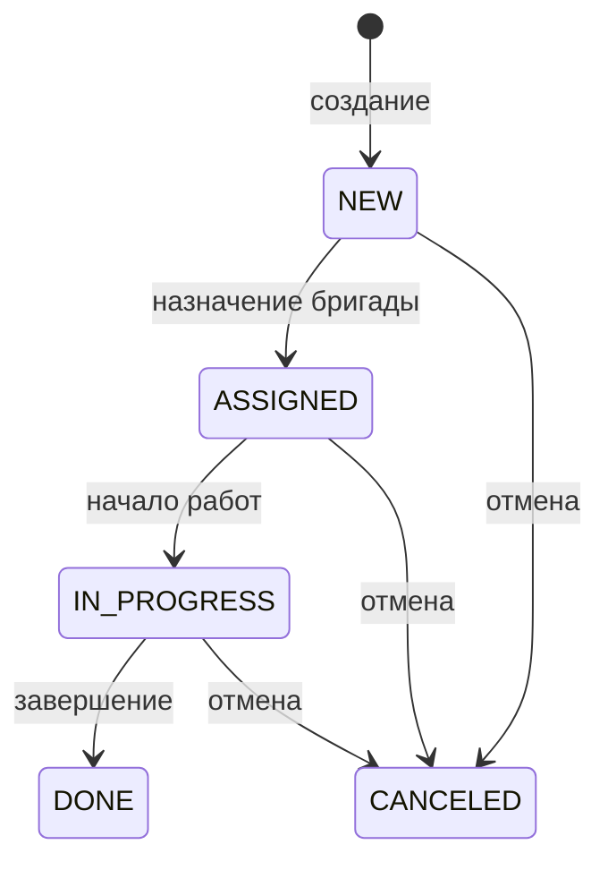
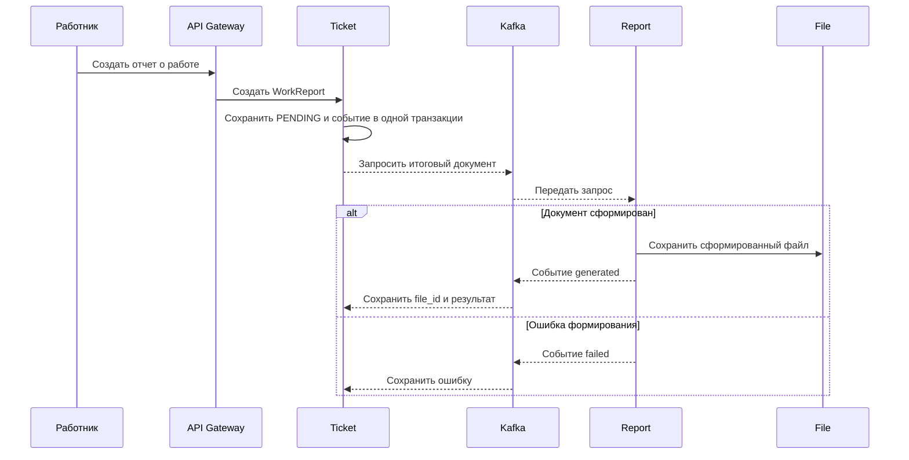

# Сервис заявок (Ticket Service)

## Общее описание и общий принцип работы

`Ticket Service` управляет заявками жителей: создает их, назначает бригады, изменяет состояние, хранит историю, связывает заявку с городским объектом и принимает отчеты о выполненных работах. Сервис также ведет справочник категорий и публикует изменения через таблицу `outbox_events`.

Основной жизненный цикл заявки: `NEW -> ASSIGNED -> IN_PROGRESS -> DONE`. Из `NEW`, `ASSIGNED` и `IN_PROGRESS` заявку можно перевести в `CANCELED`. Состояния `DONE` и `CANCELED` являются конечными. В базе также предусмотрено состояние `ARCHIVED`, которое используется механизмом хранения старых данных, но не входит в публичное перечисление `TicketStatus`.

Права доступа определяются ролями и принадлежностью:

- `admin` и `dispatcher` считаются привилегированными ролями;
- обычный пользователь создает и читает собственные заявки;
- `worker` получает заявки своей бригады, может начать и завершить назначенную ей работу и добавлять отчеты;
- назначать бригаду и управлять категориями могут только привилегированные роли.

Изменяющие операции поддерживают ключ идемпотентности из контекста. Один ключ, операция и исполнитель соответствуют одному хешу запроса. Повтор завершенной операции возвращает сохраненный ответ, параллельная операция сообщает о незавершенной обработке, а повтор с другим содержимым считается конфликтом.

### Состояния заявки



`DONE` и `CANCELED` не имеют исходящих переходов. Схема повторяет
[`validateStatusTransition`](src/core/repository/ticket_repo.go), а не
переходы, предполагаемые интерфейсом.

### Формирование итогового отчета



При расхождении между созданным файлом и сохраненным результатом действует
отдельная компенсация. Запрос создается в
[`report_repo.go`](src/core/repository/report_repo.go), результат обрабатывает
[`reportconsumer`](src/infrastructure/reportconsumer/worker.go), а формирование
выполняет [Report Service](../Report_Service/src/infrastructure/completionconsumer/worker.go).

## Модели

### Перечисления

| Тип | Значения | Назначение |
|---|---|---|
| `TicketStatus` | `NEW`, `ASSIGNED`, `IN_PROGRESS`, `DONE`, `CANCELED` | Состояние заявки в прикладном коде. |
| `TicketPriority` | `LOW`, `MEDIUM`, `HIGH`, `EMERGENCY` | Срочность выполнения заявки. |
| `TicketSortBy` | `created_at`, `updated_at`, `priority`, `status` | Поле сортировки списка. |
| `SortOrder` | `asc`, `desc` | Направление сортировки. |

Методы `IsValid` каждого перечисления возвращают `true` только для перечисленных значений.

### `Ticket`

| Поле | Тип Go | Назначение |
|---|---|---|
| `ID` | `uuid.UUID` | Идентификатор заявки. |
| `DepartmentID` | `uuid.UUID` | Подразделение, ответственное за заявку; также ключ распределения данных. |
| `CategoryID` | `uuid.UUID` | Категория проблемы. |
| `UserID` | `uuid.UUID` | Пользователь, создавший заявку. |
| `BrigadeID` | `*uuid.UUID` | Назначенная бригада; отсутствует до назначения. |
| `AssetID` | `*uuid.UUID` | Городской объект, к которому относится заявка. |
| `Title` | `string` | Краткий заголовок. |
| `Description` | `string` | Подробное описание проблемы. |
| `Status` | `TicketStatus` | Текущее состояние. |
| `Priority` | `TicketPriority` | Срочность. |
| `Address` | `string` | Текстовый адрес. |
| `Latitude` | `float64` | Широта места заявки. |
| `Longitude` | `float64` | Долгота места заявки. |
| `CreatedAt` | `time.Time` | Время создания. |
| `UpdatedAt` | `time.Time` | Время последнего изменения. |
| `AssignedAt` | `*time.Time` | Время назначения бригады. |
| `CompletedAt` | `*time.Time` | Время завершения. |
| `CanceledAt` | `*time.Time` | Время отмены. |

### `TicketCategory`

| Поле | Тип Go | Назначение |
|---|---|---|
| `ID` | `uuid.UUID` | Идентификатор категории. |
| `Code` | `string` | Уникальный машинный код из строчных латинских букв, цифр, `_` и `-`. |
| `Name` | `string` | Отображаемое название. |
| `Description` | `string` | Описание назначения категории. |
| `IsActive` | `bool` | Можно ли использовать категорию для новых заявок. |
| `CreatedAt` | `time.Time` | Время создания. |
| `UpdatedAt` | `time.Time` | Время изменения. |

### `TicketStatusHistory`

| Поле | Тип Go | Назначение |
|---|---|---|
| `ID` | `uuid.UUID` | Идентификатор записи истории. |
| `TicketID` | `uuid.UUID` | Заявка, состояние которой изменилось. |
| `OldStatus` | `*TicketStatus` | Предыдущее состояние; отсутствует у первой записи. |
| `NewStatus` | `TicketStatus` | Новое состояние. |
| `ChangedBy` | `*uuid.UUID` | Пользователь, выполнивший изменение. |
| `Comment` | `*string` | Причина или пояснение. |
| `CreatedAt` | `time.Time` | Время перехода. |

### `WorkReport`

| Поле | Тип Go | Назначение |
|---|---|---|
| `ID` | `uuid.UUID` | Идентификатор отчета. |
| `TicketID` | `uuid.UUID` | Заявка, к которой относится отчет. |
| `AuthorUserID` | `uuid.UUID` | Автор отчета. |
| `Description` | `string` | Описание выполненных работ длиной от 1 до 4000 символов. |
| `FileIDs` | `[]uuid.UUID` | До 20 уникальных идентификаторов приложенных файлов. |
| `CreatedAt` | `time.Time` | Время создания. |
| `UpdatedAt` | `time.Time` | Время изменения. |
| `CompletionStatus` | `string` | Состояние формирования итогового файла. |
| `CompletionFileID` | `*uuid.UUID` | Идентификатор созданного итогового файла. |
| `CompletionError` | `string` | Текст ошибки формирования итогового файла. |

### Модели итогового отчета

| Структура | Поля и назначение |
|---|---|
| `CompletionReportInput` | `RequestedBy` — инициатор; `ActorRoles` — его роли; `OpenedBy` — автор заявки; `Brigade` — снимок бригады. |
| `CompletionBrigadeInput` | `ID` — идентификатор; `Name` — название; `Members` — состав бригады. |
| `CompletionBrigadeMemberInput` | `UserID` — участник; `FullName` — полное имя; `Role` — роль в бригаде. |

### Входные и выходные модели заявок

| Структура | Поля | Назначение |
|---|---|---|
| `CreateTicketInput` | `DepartmentID`, `CategoryID`, `UserID`, `Title`, `Description`, `Priority`, `Address`, `Latitude`, `Longitude`, `AssetID`, `ActorUserID`, `ActorRoles` | Новая заявка, необязательная связь с объектом и сведения об исполнителе запроса. |
| `CreateTicketResult` | `Ticket` | Созданная заявка. |
| `GetTicketInput` | `TicketID`, `ActorUserID`, `ActorBrigadeID`, `ActorRoles` | Идентификатор и данные для проверки доступа. |
| `GetTicketResult` | `Ticket` | Найденная заявка. |
| `ListTicketsInput` | фильтры по подразделению, пользователю, бригаде, категории, состоянию, приоритету и времени; сортировка; `Limit`, `Offset`; данные исполнителя | Условия выборки заявок. |
| `ListTicketsResult` | `Tickets`, `Total` | Страница заявок и общее количество. |
| `UpdateTicketInput` | `TicketID`; необязательные `Title`, `Description`, `CategoryID`, `Priority`, `Address`, координаты, `AssetID`; `UpdatedBy`, данные исполнителя | Частичное изменение заявки. Координаты передаются только парой. |
| `UpdateTicketResult` | `Ticket` | Обновленная заявка. |
| `ChangeTicketStatusInput` | `TicketID`, `NewStatus`, `ChangedBy`, `Comment`, `ActorBrigadeID`, `ActorRoles` | Общая операция перехода состояния. |
| `ChangeTicketStatusResult` | `Ticket` | Заявка после перехода. |
| `AssignBrigadeInput` | `TicketID`, `BrigadeID`, `AssignedBy`, `Comment`, `ActorRoles` | Назначение бригады. |
| `AssignBrigadeResult` | `Ticket` | Назначенная заявка. |
| `CancelTicketInput` | `TicketID`, `CanceledBy`, `Reason`, `ActorRoles` | Отмена с обязательной причиной. |
| `CancelTicketResult` | `Ticket` | Отмененная заявка. |
| `CompleteTicketInput` | `TicketID`, `CompletedBy`, `Comment`, `ActorBrigadeID`, `ActorRoles` | Завершение работы. |
| `CompleteTicketResult` | `Ticket` | Завершенная заявка. |
| `GetTicketStatusHistoryInput` | `TicketID`, `Limit`, `Offset`, данные исполнителя | Запрос истории с проверкой доступа. |
| `GetTicketStatusHistoryResult` | `History`, `Total` | Записи истории и их общее количество. |

### Входные и выходные модели категорий и отчетов

| Структура | Поля | Назначение |
|---|---|---|
| `CreateCategoryInput` | `Code`, `Name`, `Description`, `ActorRoles` | Создание категории. |
| `CreateCategoryResult` | `Category` | Созданная категория. |
| `GetCategoryInput` | `CategoryID` | Поиск категории. |
| `GetCategoryResult` | `Category` | Найденная категория. |
| `ListCategoriesInput` | `OnlyActive`, `Limit`, `Offset` | Фильтр и страница категорий. |
| `ListCategoriesResult` | `Categories`, `Total` | Категории и общее количество. |
| `UpdateCategoryInput` | `CategoryID`, необязательные `Name`, `Description`, `IsActive`, `ActorRoles` | Частичное изменение категории. |
| `UpdateCategoryResult` | `Category` | Обновленная категория. |
| `DeleteCategoryInput` | `CategoryID`, `ActorRoles` | Удаление категории. |
| `DeleteCategoryResult` | `Category` | Удаленная категория. |
| `CreateWorkReportInput` | `TicketID`, `AuthorUserID`, `Description`, `FileIDs`, данные бригады и ролей, `IdempotencyKey`, `Completion` | Создание обычного или итогового отчета. |

## Функции

Имя функции открывает её реализацию в ветке `test`; структуры параметров и результатов описаны в конце README.

### func [NewService](https://github.com/FIZZI-77/automatic_system/blob/test/Ticket_Service/src/core/service/service.go#L40)

```go
func NewService(repo *repository.Repository, logger *zap.Logger) *Service
```

Типы: [Repository](#type-repository), [Service](#type-service).

При отсутствии журнала подставляет `zap.NewNop()`, создает службы заявок и категорий с общим хранилищем и добавляет `ReportService`. Возвращает единый `Service`.

### func [NewTicketServiceStruct](https://github.com/FIZZI-77/automatic_system/blob/test/Ticket_Service/src/core/service/ticket_service.go#L21)

```go
func NewTicketServiceStruct(repo *repository.Repository, logger *zap.Logger) *TicketServiceStruct
```

Типы: [Repository](#type-repository), [TicketServiceStruct](#type-ticketservicestruct).

Структуры: [TicketServiceStruct](#type-ticketservicestruct).

Создают соответствующую службу и сохраняют необходимые зависимости. `NewReportService` отдельно получает интерфейс заявок и создает хранилище отчетов поверх общего `Repository`.

### func [NewCategoryServiceStruct](https://github.com/FIZZI-77/automatic_system/blob/test/Ticket_Service/src/core/service/category_service.go#L21)

```go
func NewCategoryServiceStruct(repo *repository.Repository, logger *zap.Logger) *CategoryServiceStruct
```

Типы: [CategoryServiceStruct](#type-categoryservicestruct), [Repository](#type-repository).

Структуры: [CategoryServiceStruct](#type-categoryservicestruct).

Создают соответствующую службу и сохраняют необходимые зависимости. `NewReportService` отдельно получает интерфейс заявок и создает хранилище отчетов поверх общего `Repository`.

### func [NewReportService](https://github.com/FIZZI-77/automatic_system/blob/test/Ticket_Service/src/core/service/report_service.go#L17)

```go
func NewReportService(repo *repository.Repository) *ReportService
```

Типы: [ReportService](#type-reportservice), [Repository](#type-repository).

Структуры: [ReportService](#type-reportservice).

Создают соответствующую службу и сохраняют необходимые зависимости. `NewReportService` отдельно получает интерфейс заявок и создает хранилище отчетов поверх общего `Repository`.

### func [hasRole](https://github.com/FIZZI-77/automatic_system/blob/test/Ticket_Service/src/core/service/ticket_service.go#L190)

```go
func hasRole(roles []string, expected string) bool
```

`hasRole` ищет точное значение роли. `hasPrivilegedRole` распознает `admin` и `dispatcher`. `canReadTicket` разрешает чтение привилегированным ролям, владельцу заявки и работнику той бригады, которая назначена на заявку.

### func [hasPrivilegedRole](https://github.com/FIZZI-77/automatic_system/blob/test/Ticket_Service/src/core/service/ticket_service.go#L555)

```go
func hasPrivilegedRole(roles []string) bool
```

`hasRole` ищет точное значение роли. `hasPrivilegedRole` распознает `admin` и `dispatcher`. `canReadTicket` разрешает чтение привилегированным ролям, владельцу заявки и работнику той бригады, которая назначена на заявку.

### func [canReadTicket](https://github.com/FIZZI-77/automatic_system/blob/test/Ticket_Service/src/core/service/ticket_service.go#L539)

```go
func canReadTicket(ticket *models.Ticket, actorUserID, actorBrigadeID *uuid.UUID, actorRoles []string) bool
```

Типы: [Ticket](#type-ticket).

Структуры: [Ticket](#type-ticket).

`hasRole` ищет точное значение роли. `hasPrivilegedRole` распознает `admin` и `dispatcher`. `canReadTicket` разрешает чтение привилегированным ролям, владельцу заявки и работнику той бригады, которая назначена на заявку.

### func [withIdempotency](https://github.com/FIZZI-77/automatic_system/blob/test/Ticket_Service/src/core/service/idempotency.go#L19)

```go
func withIdempotency(repo *repository.Repository, ctx context.Context, operation string, actorKey string, request any, fn func(context.Context) (any, uuid.UUID, error)) (any, error)
```

Типы: [Repository](#type-repository).

Если ключа в контексте нет, немедленно выполняет функцию. Иначе сериализует запрос, вычисляет SHA-256 и пытается получить запись на 24 часа. Новый ключ выполняет функцию в транзакции. Для существующего ключа проверяет совпадение хеша и в зависимости от состояния возвращает сохраненный ответ, `ErrIdempotencyInProgress` или `ErrIdempotencyFailed`.

### func [cachedResult](https://github.com/FIZZI-77/automatic_system/blob/test/Ticket_Service/src/core/service/idempotency.go#L71)

```go
func cachedResult[T any](result any) (*T, error)
```

Возвращает указатель непосредственно, если тип уже совпадает. Сохраненный ответ вида `map[string]any` преобразует в требуемый тип через JSON.

### func [hashRequest](https://github.com/FIZZI-77/automatic_system/blob/test/Ticket_Service/src/core/service/idempotency.go#L89)

```go
func hashRequest(request any) (string, error)
```

Сериализует запрос в JSON и возвращает шестнадцатеричную строку SHA-256. Ошибка сериализации оборачивается контекстом операции.

### func [idempotencyActor](https://github.com/FIZZI-77/automatic_system/blob/test/Ticket_Service/src/core/service/idempotency.go#L99)

```go
func idempotencyActor(actor *uuid.UUID, fallback uuid.UUID) string
```

Возвращает переданный идентификатор исполнителя, затем запасной UUID, а при отсутствии обоих — пустую строку.

### func (*TicketServiceStruct) [CreateTicket](https://github.com/FIZZI-77/automatic_system/blob/test/Ticket_Service/src/core/service/ticket_service.go#L25)

```go
func (s *TicketServiceStruct) CreateTicket(ctx context.Context, in *models.CreateTicketInput) (*models.CreateTicketResult, error)
```

Типы: [CreateTicketInput](#type-createticketinput), [CreateTicketResult](#type-createticketresult), [TicketServiceStruct](#type-ticketservicestruct).

1. Проверяет обязательные UUID, заголовок до 255 символов, описание до 3000, приоритет, адрес до 500 и координаты.
2. Для непривилегированного исполнителя требует, чтобы `ActorUserID` совпадал с `UserID` создаваемой заявки.
3. Выполняет создание через защиту идемпотентности.
4. Хранилище проверяет активность категории, создает заявку `NEW`, первую запись истории и событие `ticket.created` в одной транзакции.
5. Возвращает созданную заявку или ранее сохраненный ответ для повторного ключа.


### func (*TicketServiceStruct) [GetTicket](https://github.com/FIZZI-77/automatic_system/blob/test/Ticket_Service/src/core/service/ticket_service.go#L82)

```go
func (s *TicketServiceStruct) GetTicket(ctx context.Context, in *models.GetTicketInput) (*models.GetTicketResult, error)
```

Типы: [GetTicketInput](#type-getticketinput), [GetTicketResult](#type-getticketresult), [TicketServiceStruct](#type-ticketservicestruct).

Проверяет UUID, загружает заявку и вызывает `canReadTicket`. Доступ получает владелец, привилегированная роль или работник назначенной бригады.


### func (*TicketServiceStruct) [ListTickets](https://github.com/FIZZI-77/automatic_system/blob/test/Ticket_Service/src/core/service/ticket_service.go#L124)

```go
func (s *TicketServiceStruct) ListTickets(ctx context.Context, in *models.ListTicketsInput) (*models.ListTicketsResult, error)
```

Типы: [ListTicketsInput](#type-listticketsinput), [ListTicketsResult](#type-listticketsresult), [TicketServiceStruct](#type-ticketservicestruct).

До проверки фильтра ограничивает область видимости: работнику принудительно оставляет только его бригаду, обычному пользователю — только его `UserID`; привилегированные роли сохраняют переданные фильтры. Затем подставляет сортировку `created_at desc`, нормализует страницу до диапазона 1–100 записей и запрашивает список с общим количеством.


### func (*TicketServiceStruct) [UpdateTicket](https://github.com/FIZZI-77/automatic_system/blob/test/Ticket_Service/src/core/service/ticket_service.go#L199)

```go
func (s *TicketServiceStruct) UpdateTicket(ctx context.Context, in *models.UpdateTicketInput) (*models.UpdateTicketResult, error)
```

Типы: [TicketServiceStruct](#type-ticketservicestruct), [UpdateTicketInput](#type-updateticketinput), [UpdateTicketResult](#type-updateticketresult).

Проверяет UUID, переданные текстовые поля, перечисления, парность координат и обязательный `UpdatedBy`. Затем выполняет частичное обновление через идемпотентную транзакцию и возвращает актуальную заявку. Проверка допустимости конкретного изменения и запись события находятся в хранилище.


### func (*TicketServiceStruct) [ChangeTicketStatus](https://github.com/FIZZI-77/automatic_system/blob/test/Ticket_Service/src/core/service/ticket_service.go#L253)

```go
func (s *TicketServiceStruct) ChangeTicketStatus(ctx context.Context, in *models.ChangeTicketStatusInput) (*models.ChangeTicketStatusResult, error)
```

Типы: [ChangeTicketStatusInput](#type-changeticketstatusinput), [ChangeTicketStatusResult](#type-changeticketstatusresult), [TicketServiceStruct](#type-ticketservicestruct).

Проверяет запрос. Непривилегированный исполнитель должен быть `worker`, может выбрать только `IN_PROGRESS` и обязан принадлежать назначенной бригаде. Операция выполняется идемпотентно; хранилище блокирует запись, проверяет переход, добавляет историю и событие.


### func (*TicketServiceStruct) [AssignBrigade](https://github.com/FIZZI-77/automatic_system/blob/test/Ticket_Service/src/core/service/ticket_service.go#L316)

```go
func (s *TicketServiceStruct) AssignBrigade(ctx context.Context, in *models.AssignBrigadeInput) (*models.AssignBrigadeResult, error)
```

Типы: [AssignBrigadeInput](#type-assignbrigadeinput), [AssignBrigadeResult](#type-assignbrigaderesult), [TicketServiceStruct](#type-ticketservicestruct).

Разрешена только `admin` или `dispatcher`. Проверяет UUID и комментарий, затем идемпотентно назначает бригаду. Хранилище использует транзакционную блокировку по бригаде и не допускает одновременно две заявки `ASSIGNED`/`IN_PROGRESS` для одной бригады; состояние заявки становится `ASSIGNED`.


### func (*TicketServiceStruct) [CancelTicket](https://github.com/FIZZI-77/automatic_system/blob/test/Ticket_Service/src/core/service/ticket_service.go#L370)

```go
func (s *TicketServiceStruct) CancelTicket(ctx context.Context, in *models.CancelTicketInput) (*models.CancelTicketResult, error)
```

Типы: [CancelTicketInput](#type-cancelticketinput), [CancelTicketResult](#type-cancelticketresult), [TicketServiceStruct](#type-ticketservicestruct).

Загружает заявку после проверки входа. Непривилегированный пользователь может отменить только собственную заявку. В транзакции проверяется допустимость перехода, устанавливается `CANCELED`, сохраняются время, причина в истории и событие `ticket.canceled`.


### func (*TicketServiceStruct) [CompleteTicket](https://github.com/FIZZI-77/automatic_system/blob/test/Ticket_Service/src/core/service/ticket_service.go#L427)

```go
func (s *TicketServiceStruct) CompleteTicket(ctx context.Context, in *models.CompleteTicketInput) (*models.CompleteTicketResult, error)
```

Типы: [CompleteTicketInput](#type-completeticketinput), [CompleteTicketResult](#type-completeticketresult), [TicketServiceStruct](#type-ticketservicestruct).

Привилегированная роль может завершить заявку напрямую. Иначе исполнитель должен иметь роль `worker` и принадлежать назначенной бригаде. Идемпотентная операция переводит заявку из `IN_PROGRESS` в `DONE`, устанавливает время, добавляет историю и событие `ticket.completed`.


### func (*TicketServiceStruct) [GetTicketStatusHistory](https://github.com/FIZZI-77/automatic_system/blob/test/Ticket_Service/src/core/service/ticket_service.go#L488)

```go
func (s *TicketServiceStruct) GetTicketStatusHistory(ctx context.Context, in *models.GetTicketStatusHistoryInput) (*models.GetTicketStatusHistoryResult, error)
```

Типы: [GetTicketStatusHistoryInput](#type-getticketstatushistoryinput), [GetTicketStatusHistoryResult](#type-getticketstatushistoryresult), [TicketServiceStruct](#type-ticketservicestruct).

Проверяет заявку и параметры страницы, загружает заявку для проверки доступа, затем возвращает историю в прямом хронологическом порядке и полное количество записей.


### func (*CategoryServiceStruct) [CreateCategory](https://github.com/FIZZI-77/automatic_system/blob/test/Ticket_Service/src/core/service/category_service.go#L28)

```go
func (s *CategoryServiceStruct) CreateCategory(ctx context.Context, in *models.CreateCategoryInput) (*models.CreateCategoryResult, error)
```

Типы: [CategoryServiceStruct](#type-categoryservicestruct), [CreateCategoryInput](#type-createcategoryinput), [CreateCategoryResult](#type-createcategoryresult).

Проверяет код, название и описание, требует привилегированную роль и идемпотентно создает категорию. Код содержит только строчные латинские буквы, цифры, `_` или `-`.


### func (*CategoryServiceStruct) [GetCategory](https://github.com/FIZZI-77/automatic_system/blob/test/Ticket_Service/src/core/service/category_service.go#L80)

```go
func (s *CategoryServiceStruct) GetCategory(ctx context.Context, in *models.GetCategoryInput) (*models.GetCategoryResult, error)
```

Типы: [CategoryServiceStruct](#type-categoryservicestruct), [GetCategoryInput](#type-getcategoryinput), [GetCategoryResult](#type-getcategoryresult).

Проверяет `CategoryID`, загружает категорию и возвращает ее. Дополнительного ограничения по роли нет.


### func (*CategoryServiceStruct) [ListCategories](https://github.com/FIZZI-77/automatic_system/blob/test/Ticket_Service/src/core/service/category_service.go#L118)

```go
func (s *CategoryServiceStruct) ListCategories(ctx context.Context, in *models.ListCategoriesInput) (*models.ListCategoriesResult, error)
```

Типы: [CategoryServiceStruct](#type-categoryservicestruct), [ListCategoriesInput](#type-listcategoriesinput), [ListCategoriesResult](#type-listcategoriesresult).

Нормализует страницу, при необходимости оставляет только активные категории и возвращает список с общим количеством.


### func (*CategoryServiceStruct) [UpdateCategory](https://github.com/FIZZI-77/automatic_system/blob/test/Ticket_Service/src/core/service/category_service.go#L157)

```go
func (s *CategoryServiceStruct) UpdateCategory(ctx context.Context, in *models.UpdateCategoryInput) (*models.UpdateCategoryResult, error)
```

Типы: [CategoryServiceStruct](#type-categoryservicestruct), [UpdateCategoryInput](#type-updatecategoryinput), [UpdateCategoryResult](#type-updatecategoryresult).

Требует хотя бы одно из полей `Name`, `Description`, `IsActive`, проверяет значения и привилегированную роль. Изменение выполняется идемпотентно.


### func (*CategoryServiceStruct) [DeleteCategory](https://github.com/FIZZI-77/automatic_system/blob/test/Ticket_Service/src/core/service/category_service.go#L215)

```go
func (s *CategoryServiceStruct) DeleteCategory(ctx context.Context, in *models.DeleteCategoryInput) (*models.DeleteCategoryResult, error)
```

Типы: [CategoryServiceStruct](#type-categoryservicestruct), [DeleteCategoryInput](#type-deletecategoryinput), [DeleteCategoryResult](#type-deletecategoryresult).

Проверяет UUID и привилегированную роль, затем идемпотентно вызывает удаление. Хранилище возвращает удаленную категорию или ошибку, если операция невозможна.


### func (*ReportService) [Create](https://github.com/FIZZI-77/automatic_system/blob/test/Ticket_Service/src/core/service/report_service.go#L21)

```go
func (s *ReportService) Create(ctx context.Context, in *models.CreateWorkReportInput) (*models.WorkReport, error)
```

Типы: [CreateWorkReportInput](#type-createworkreportinput), [ReportService](#type-reportservice), [WorkReport](#type-workreport).

1. Убирает пробелы по краям описания, проверяет длину, UUID и до 20 уникальных файлов.
2. Загружает заявку и разрешает отчет только для `ASSIGNED` или `IN_PROGRESS`.
3. Непривилегированный автор должен быть работником назначенной бригады.
4. Хранилище создает отчет и связи с файлами в одной транзакции.
5. Обычный отчет создает событие `ticket.report.created`.
6. При наличии `Completion` отчет получает состояние `PENDING`, срок десять минут и событие `ticket.completion_report.requested.v1` со снимком заявки и бригады.


### func (*ReportService) [List](https://github.com/FIZZI-77/automatic_system/blob/test/Ticket_Service/src/core/service/report_service.go#L27)

```go
func (s *ReportService) List(ctx context.Context, ticketID, actor uuid.UUID, actorBrigadeID *uuid.UUID, roles []string) ([]*models.WorkReport, error)
```

Типы: [ReportService](#type-reportservice), [WorkReport](#type-workreport).

Загружает заявку, проверяет доступ через `canReadTicket` и возвращает отчеты в порядке от новых к старым вместе с идентификаторами файлов.


### func (*TicketServiceStruct) [withIdempotency](https://github.com/FIZZI-77/automatic_system/blob/test/Ticket_Service/src/core/service/idempotency.go#L63)

```go
func (s *TicketServiceStruct) withIdempotency(ctx context.Context, operation string, actorKey string, request any, fn func(context.Context) (any, uuid.UUID, error)) (any, error)
```

Типы: [TicketServiceStruct](#type-ticketservicestruct).

Передают общее хранилище и параметры в `withIdempotency`.


### func (*CategoryServiceStruct) [withIdempotency](https://github.com/FIZZI-77/automatic_system/blob/test/Ticket_Service/src/core/service/idempotency.go#L67)

```go
func (s *CategoryServiceStruct) withIdempotency(ctx context.Context, operation string, actorKey string, request any, fn func(context.Context) (any, uuid.UUID, error)) (any, error)
```

Типы: [CategoryServiceStruct](#type-categoryservicestruct).

Передают общее хранилище и параметры в `withIdempotency`.


## Группы обработчиков

### Проверки входных данных

`validateUUID` запрещает нулевой UUID; `validateOptionalUUID` проверяет только заданное значение; `validateText` требует непустой текст с ограничением длины; `validateOptionalText` делает то же для указателя; `validateCoordinates` проверяет широту и долготу; `normalizeLimitOffset` подставляет `20`, ограничивает размер `100` и исправляет отрицательное смещение на ноль; `isValidCode` посимвольно проверяет код категории. Методы `Validate` входных моделей объединяют эти правила и нормализуют сортировку и страницу там, где это требуется.

## Структура БД

### Таблица `ticket_categories`

| Поле | Тип PostgreSQL | Назначение |
|---|---|---|
| `id` | `uuid` | Первичный ключ категории. |
| `code` | `varchar(100)` | Уникальный машинный код. |
| `name` | `varchar(255)` | Название. |
| `description` | `text` | Необязательное описание. |
| `is_active` | `boolean` | Доступность категории; по умолчанию `true`. |
| `created_at` | `timestamp` | Время создания. |
| `updated_at` | `timestamp` | Время изменения. |

### Таблица `tickets`

| Поле | Тип PostgreSQL | Назначение |
|---|---|---|
| `id` | `uuid` | Идентификатор заявки; часть составного первичного ключа. |
| `department_id` | `uuid` | Подразделение и ключ распределения; часть первичного ключа. |
| `user_id` | `uuid` | Автор заявки. |
| `brigade_id` | `uuid` | Назначенная бригада. |
| `asset_id` | `uuid` | Связанный городской объект. |
| `title` | `varchar(255)` | Заголовок. |
| `description` | `text` | Описание. |
| `category_id` | `uuid` | Ссылка на `ticket_categories`. |
| `priority` | `varchar(50)` | Один из четырех приоритетов. |
| `status` | `varchar(50)` | Состояние, включая служебное `ARCHIVED`. |
| `address` | `text` | Адрес. |
| `latitude` | `double precision` | Широта. |
| `longitude` | `double precision` | Долгота. |
| `created_at` | `timestamp` | Время создания. |
| `updated_at` | `timestamp` | Время изменения. |
| `assigned_at` | `timestamp` | Время назначения. |
| `completed_at` | `timestamp` | Время завершения. |
| `canceled_at` | `timestamp` | Время отмены. |
| `archived_at` | `timestamptz` | Время переноса в архивное состояние. |

Уникальный частичный индекс не допускает две активные заявки одной бригады в одном подразделении.

### Таблица `ticket_status_history`

| Поле | Тип PostgreSQL | Назначение |
|---|---|---|
| `id` | `uuid` | Идентификатор записи; часть первичного ключа. |
| `department_id` | `uuid` | Ключ распределения и часть первичного ключа. |
| `ticket_id` | `uuid` | Заявка; вместе с подразделением образует внешний ключ. |
| `old_status` | `varchar(50)` | Предыдущее состояние. |
| `new_status` | `varchar(50)` | Новое состояние. |
| `changed_by` | `uuid` | Пользователь, выполнивший переход. |
| `comment` | `text` | Пояснение или причина. |
| `created_at` | `timestamp` | Время перехода. |

### Таблица `outbox_events`

| Поле | Тип PostgreSQL | Назначение |
|---|---|---|
| `id` | `uuid` | Первичный ключ события. |
| `aggregate_type` | `varchar(100)` | Вид измененной сущности. |
| `aggregate_id` | `uuid` | Идентификатор сущности. |
| `event_type` | `varchar(100)` | Тип события. |
| `payload` | `jsonb` | Данные события. |
| `status` | `varchar(50)` | `PENDING`, `PROCESSING`, `SENT` или `FAILED`. |
| `attempts` | `integer` | Число попыток. |
| `last_error` | `text` | Последняя ошибка. |
| `next_attempt_at` | `timestamp` | Время следующей попытки. |
| `locked_at` | `timestamp` | Время захвата обработчиком. |
| `created_at` | `timestamp` | Время создания. |
| `sent_at` | `timestamp` | Время публикации. |

### Таблица `idempotency_keys`

| Поле | Тип PostgreSQL | Назначение |
|---|---|---|
| `id` | `uuid` | Первичный ключ. |
| `actor_key` | `varchar(128)` | Исполнитель операции. |
| `operation` | `varchar(100)` | Название операции. |
| `idempotency_key` | `varchar(128)` | Ключ запроса. |
| `request_hash` | `varchar(128)` | SHA-256 содержимого запроса. |
| `status` | `varchar(32)` | `PROCESSING`, `COMPLETED` или `FAILED`. |
| `response` | `jsonb` | Сохраненный успешный ответ. |
| `error` | `text` | Сохраненная ошибка. |
| `resource_type` | `varchar(100)` | Вид созданного ресурса. |
| `resource_id` | `uuid` | Идентификатор ресурса. |
| `created_at` | `timestamp` | Время создания. |
| `updated_at` | `timestamp` | Время изменения. |
| `expires_at` | `timestamp` | Окончание срока хранения; по умолчанию через 24 часа. |

Сочетание `actor_key`, `operation`, `idempotency_key` уникально.

### Таблица `routing_inbox_events`

| Поле | Тип PostgreSQL | Назначение |
|---|---|---|
| `event_id` | `uuid` | Первичный ключ события маршрутизации. |
| `event_type` | `varchar(128)` | Тип события. |
| `topic` | `varchar(255)` | Раздел Kafka. |
| `partition_id` | `integer` | Номер раздела. |
| `message_offset` | `bigint` | Позиция сообщения. |
| `payload` | `jsonb` | Полученные данные. |
| `processed_at` | `timestamp` | Время обработки. |

### Таблица `ticket_reports`

| Поле | Тип PostgreSQL | Назначение |
|---|---|---|
| `id` | `uuid` | Идентификатор отчета; часть первичного ключа. |
| `department_id` | `uuid` | Подразделение; часть первичного ключа и внешнего ключа. |
| `ticket_id` | `uuid` | Заявка. |
| `author_user_id` | `uuid` | Автор отчета. |
| `description` | `text` | Описание от 1 до 4000 символов. |
| `idempotency_key` | `text` | Необязательный ключ повторного запроса. |
| `completion_status` | `text` | `NONE`, `PENDING`, `COMPLETED`, `FAILED`, `COMPENSATING` или `COMPENSATED`. |
| `completion_file_id` | `uuid` | Созданный итоговый файл. |
| `completion_error` | `text` | Ошибка формирования. |
| `completion_attempts` | `integer` | Число попыток формирования. |
| `completion_compensation_attempts` | `integer` | Число попыток компенсирующей операции. |
| `completion_deadline_at` | `timestamptz` | Предельное время текущей попытки. |
| `completion_updated_at` | `timestamptz` | Время последнего изменения процесса. |
| `created_at` | `timestamptz` | Время создания. |
| `updated_at` | `timestamptz` | Время изменения. |

### Таблица `ticket_report_files`

| Поле | Тип PostgreSQL | Назначение |
|---|---|---|
| `department_id` | `uuid` | Подразделение и часть составных ключей. |
| `report_id` | `uuid` | Отчет. |
| `file_id` | `uuid` | Приложенный файл; уникален в пределах подразделения. |
| `created_at` | `timestamptz` | Время добавления связи. |

### Таблица `completion_report_inbox`

| Поле | Тип PostgreSQL | Назначение |
|---|---|---|
| `event_id` | `uuid` | Первичный ключ уже обработанного события итогового отчета. |
| `received_at` | `timestamptz` | Время получения события. |

## Структуры параметров и результатов

### type AssignBrigadeInput

```go
type AssignBrigadeInput struct {
	TicketID   uuid.UUID
	BrigadeID  uuid.UUID
	AssignedBy uuid.UUID
	Comment    *string
	ActorRoles []string
}
```

### type AssignBrigadeResult

```go
type AssignBrigadeResult struct {
	Ticket *Ticket
}
```

### type CancelTicketInput

```go
type CancelTicketInput struct {
	TicketID   uuid.UUID
	CanceledBy uuid.UUID
	Reason     string
	ActorRoles []string
}
```

### type CancelTicketResult

```go
type CancelTicketResult struct {
	Ticket *Ticket
}
```

### type CategoryServiceStruct

```go
type CategoryServiceStruct struct {
	repo   *repository.Repository
	logger *zap.Logger
}
```

### type ChangeTicketStatusInput

```go
type ChangeTicketStatusInput struct {
	TicketID       uuid.UUID
	NewStatus      TicketStatus
	ChangedBy      uuid.UUID
	Comment        *string
	ActorBrigadeID *uuid.UUID
	ActorRoles     []string
}
```

### type ChangeTicketStatusResult

```go
type ChangeTicketStatusResult struct {
	Ticket *Ticket
}
```

### type CompleteTicketInput

```go
type CompleteTicketInput struct {
	TicketID       uuid.UUID
	CompletedBy    uuid.UUID
	Comment        *string
	ActorBrigadeID *uuid.UUID
	ActorRoles     []string
}
```

### type CompleteTicketResult

```go
type CompleteTicketResult struct {
	Ticket *Ticket
}
```

### type CreateCategoryInput

```go
type CreateCategoryInput struct {
	Code        string
	Name        string
	Description *string
	ActorRoles  []string
}
```

### type CreateCategoryResult

```go
type CreateCategoryResult struct {
	Category *TicketCategory
}
```

### type CreateTicketInput

```go
type CreateTicketInput struct {
	DepartmentID uuid.UUID
	CategoryID   uuid.UUID
	UserID       uuid.UUID

	Title       string
	Description string
	Priority    TicketPriority

	Address   string
	Latitude  float64
	Longitude float64
	AssetID   *uuid.UUID

	ActorUserID *uuid.UUID
	ActorRoles  []string
}
```

### type CreateTicketResult

```go
type CreateTicketResult struct {
	Ticket *Ticket
}
```

### type CreateWorkReportInput

```go
type CreateWorkReportInput struct {
	TicketID       uuid.UUID
	AuthorUserID   uuid.UUID
	Description    string
	FileIDs        []uuid.UUID
	ActorBrigadeID *uuid.UUID
	ActorRoles     []string
	IdempotencyKey string
	Completion     *CompletionReportInput
}
```

### type DeleteCategoryInput

```go
type DeleteCategoryInput struct {
	CategoryID uuid.UUID
	ActorRoles []string
}
```

### type DeleteCategoryResult

```go
type DeleteCategoryResult struct {
	Category *TicketCategory
}
```

### type GetCategoryInput

```go
type GetCategoryInput struct {
	CategoryID uuid.UUID
}
```

### type GetCategoryResult

```go
type GetCategoryResult struct {
	Category *TicketCategory
}
```

### type GetTicketInput

```go
type GetTicketInput struct {
	TicketID       uuid.UUID
	ActorUserID    *uuid.UUID
	ActorBrigadeID *uuid.UUID
	ActorRoles     []string
}
```

### type GetTicketResult

```go
type GetTicketResult struct {
	Ticket *Ticket
}
```

### type GetTicketStatusHistoryInput

```go
type GetTicketStatusHistoryInput struct {
	TicketID       uuid.UUID
	Limit          int32
	Offset         int32
	ActorUserID    *uuid.UUID
	ActorBrigadeID *uuid.UUID
	ActorRoles     []string
}
```

### type GetTicketStatusHistoryResult

```go
type GetTicketStatusHistoryResult struct {
	History []*TicketStatusHistory
	Total   int64
}
```

### type ListCategoriesInput

```go
type ListCategoriesInput struct {
	OnlyActive bool
	Limit      int32
	Offset     int32
}
```

### type ListCategoriesResult

```go
type ListCategoriesResult struct {
	Categories []*TicketCategory
	Total      int64
}
```

### type ListTicketsInput

```go
type ListTicketsInput struct {
	DepartmentID *uuid.UUID
	UserID       *uuid.UUID
	BrigadeID    *uuid.UUID
	CategoryID   *uuid.UUID

	Status   *TicketStatus
	Priority *TicketPriority

	CreatedFrom *time.Time
	CreatedTo   *time.Time

	SortBy    TicketSortBy
	SortOrder SortOrder

	Limit  int32
	Offset int32

	ActorUserID    *uuid.UUID
	ActorBrigadeID *uuid.UUID
	ActorRoles     []string
}
```

### type ListTicketsResult

```go
type ListTicketsResult struct {
	Tickets []*Ticket
	Total   int64
}
```

### type ReportService

```go
type ReportService struct {
	tickets repository.TicketRepository
	reports *repository.ReportRepository
}
```

### type Repository

```go
type Repository struct {
	writePool *pgxpool.Pool
	readPool  *pgxpool.Pool
	TicketRepository
	CategoryRepository
}
```

### type Service

```go
type Service struct {
	TicketService
	CategoryService
	Reports *ReportService
}
```

### type Ticket

```go
type Ticket struct {
	ID           uuid.UUID `json:"id"`
	DepartmentID uuid.UUID `json:"department_id"`
	CategoryID   uuid.UUID `json:"category_id"`

	UserID    uuid.UUID  `json:"user_id"`
	BrigadeID *uuid.UUID `json:"brigade_id,omitempty"`
	AssetID   *uuid.UUID `json:"asset_id,omitempty"`

	Title       string         `json:"title"`
	Description string         `json:"description"`
	Status      TicketStatus   `json:"status"`
	Priority    TicketPriority `json:"priority"`

	Address   string  `json:"address"`
	Latitude  float64 `json:"latitude"`
	Longitude float64 `json:"longitude"`

	CreatedAt   time.Time  `json:"created_at"`
	UpdatedAt   time.Time  `json:"updated_at"`
	AssignedAt  *time.Time `json:"assigned_at,omitempty"`
	CompletedAt *time.Time `json:"completed_at,omitempty"`
	CanceledAt  *time.Time `json:"canceled_at,omitempty"`
}
```

### type TicketServiceStruct

```go
type TicketServiceStruct struct {
	repo   *repository.Repository
	logger *zap.Logger
}
```

### type UpdateCategoryInput

```go
type UpdateCategoryInput struct {
	CategoryID uuid.UUID

	Name        *string
	Description *string
	IsActive    *bool
	ActorRoles  []string
}
```

### type UpdateCategoryResult

```go
type UpdateCategoryResult struct {
	Category *TicketCategory
}
```

### type UpdateTicketInput

```go
type UpdateTicketInput struct {
	TicketID uuid.UUID

	Title       *string
	Description *string
	CategoryID  *uuid.UUID
	Priority    *TicketPriority

	Address   *string
	Latitude  *float64
	Longitude *float64
	AssetID   *uuid.UUID

	UpdatedBy      *uuid.UUID
	ActorBrigadeID *uuid.UUID
	ActorRoles     []string
}
```

### type UpdateTicketResult

```go
type UpdateTicketResult struct {
	Ticket *Ticket
}
```

### type WorkReport

```go
type WorkReport struct {
	ID               uuid.UUID   `json:"id"`
	TicketID         uuid.UUID   `json:"ticket_id"`
	AuthorUserID     uuid.UUID   `json:"author_user_id"`
	Description      string      `json:"description"`
	FileIDs          []uuid.UUID `json:"file_ids"`
	CreatedAt        time.Time   `json:"created_at"`
	UpdatedAt        time.Time   `json:"updated_at"`
	CompletionStatus string      `json:"completion_status"`
	CompletionFileID *uuid.UUID  `json:"completion_file_id,omitempty"`
	CompletionError  string      `json:"completion_error,omitempty"`
}
```
