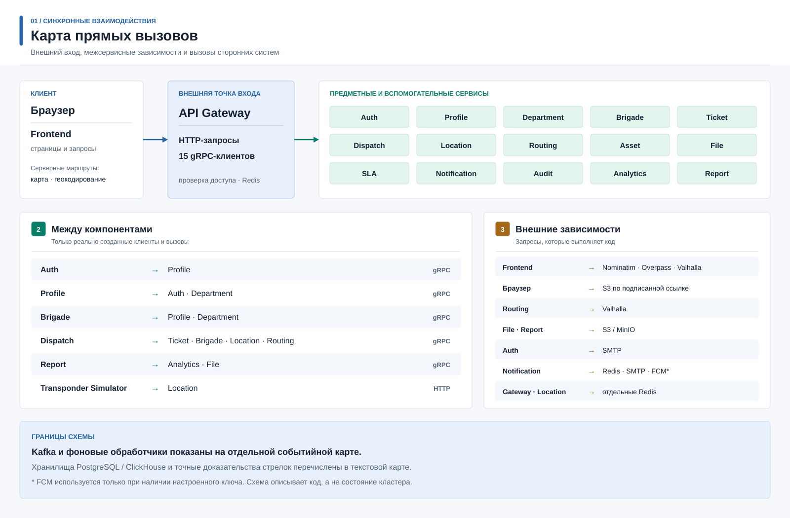
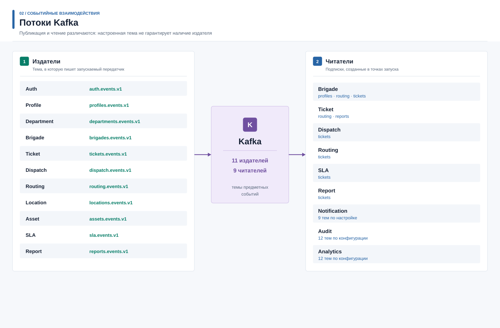

# Карта взаимодействий по исходному коду

Эта карта описывает связи, найденные в точках запуска, обработчиках и
конфигурации сервисов текущего репозитория. Стрелка означает реализованный
вызов или настроенного читателя, а не подтверждение успешной работы в
запущенном кластере. Публикация событий зависит от наличия брокеров и
успешной работы фоновых обработчиков.

## Прямые вызовы

| Откуда | Куда | Основание |
|---|---|---|
| Frontend | API Gateway | [Предметные запросы клиента](../../Frontend/app/api.ts). |
| Frontend | Nominatim, Overpass API, Valhalla | [Геокодирование](../../Frontend/app/api/geocode/route.ts), [данные объектов](../../Frontend/app/api/moscow-infrastructure/route.ts), [маршрут](../../Frontend/app/api/valhalla-route/route.ts). Это серверные маршруты самого Frontend. |
| Браузер | S3-совместимое хранилище | Загрузка по подписанной ссылке, например [на экране заявки](../../Frontend/app/ticket-workspace.tsx). |
| API Gateway | Auth, Profile, Department, Brigade, Ticket, Dispatch, Location, Routing, Asset, File, SLA, Notification, Audit, Analytics, Report | [Создание 15 gRPC-клиентов](../../API_Gateway/src/cmd/server/main.go). |
| API Gateway | Ticket, Brigade и Profile при подготовке отчета о работе | [Обработчик отчета](../../API_Gateway/src/core/handlers/report.go); создание записи выполняет Ticket. Последующее формирование документа идет через событие Kafka, а не через прямой HTTP-вызов Report. |
| Auth | Profile | [Инициализация клиента](../../Auth_Service/src/cmd/server/main.go). |
| Profile | Auth, Department | [Проверки учетной записи и подразделения](../../Profile_Service/src/cmd/server/main.go). |
| Brigade | Profile, Department | [Инициализация клиентов](../../Brigade_Service/src/cmd/server/main.go). |
| Dispatch | Ticket, Brigade, Location, Routing | [Инициализация клиентов](../../Dispatch_Service/src/cmd/server/main.go). |
| Report | Analytics, File | [Инициализация клиентов](../../Report_Service/src/cmd/server/main.go). |
| Transponder Simulator | Location по HTTP | [Передача координат](../../Transponder_Simulator/internal/simulator/sender.go); [HTTP-сервер Location](../../Location_Service/src/cmd/server/main.go). |

В коде [Ticket Service](../../Ticket_Service/src/cmd/server/main.go) не создает
gRPC-клиентов Department или Brigade. Эти связи в старой обзорной схеме были
показаны как прямые и потому не перенесены на новую карту.
У обработчика отчета шлюза есть поля для внутреннего HTTP-клиента Report, но
[текущий метод создания отчета](../../API_Gateway/src/core/handlers/report.go)
их не использует. Существование адреса в конфигурации не равно вызову.

## Хранилища и внешние системы

| Компонент | Используемая система | Основание |
|---|---|---|
| API Gateway | Redis для ограничения запросов и живых уведомлений | [Запуск шлюза](../../API_Gateway/src/cmd/server/main.go). |
| Auth | PostgreSQL, SMTP | [Запуск](../../Auth_Service/src/cmd/server/main.go), [отправка почты](../../Auth_Service/src/core/service/mail_service.go). |
| Profile | PostgreSQL | [Запуск](../../Profile_Service/src/cmd/server/main.go). |
| Department | PostgreSQL | [Запуск](../../Department_Service/src/cmd/server/main.go). |
| Brigade | PostgreSQL | [Запуск](../../Brigade_Service/src/cmd/server/main.go). |
| Ticket | PostgreSQL | [Запуск](../../Ticket_Service/src/cmd/server/main.go). Использование Citus задается развертыванием, а не этим кодом. |
| Dispatch | PostgreSQL | [Запуск](../../Dispatch_Service/src/cmd/server/main.go). |
| Location | PostgreSQL/PostGIS и Redis | [Запуск](../../Location_Service/src/cmd/server/main.go), [пространственные запросы](../../Location_Service/src/core/repository/geo_zone_repo.go). |
| Routing | PostgreSQL и Valhalla | [Запуск и создание клиента](../../Routing_Service/src/cmd/server/main.go). |
| Asset | PostgreSQL/PostGIS | [Запуск](../../Asset_Service/src/cmd/server/main.go), [пространственные запросы](../../Asset_Service/src/core/repository/asset_repository.go). |
| File | PostgreSQL и S3-совместимое хранилище | [Запуск и создание клиента](../../File_Service/src/cmd/server/main.go). |
| SLA | PostgreSQL | [Запуск](../../SLA_Service/src/cmd/server/main.go). |
| Notification | PostgreSQL, Redis, SMTP и FCM при наличии ключа | [Запуск и условная настройка FCM](../../Notification_Service/src/cmd/server/main.go). |
| Audit | PostgreSQL | [Запуск](../../Audit_Service/src/cmd/server/main.go). |
| Analytics | ClickHouse | [Подключение](../../Analytics_Service/src/cmd/server/main.go). |
| Report | PostgreSQL; File по gRPC и объектное хранилище по внутреннему HTTP для загрузки сформированного файла | [Запуск](../../Report_Service/src/cmd/server/main.go), [клиент файлов](../../Report_Service/src/infrastructure/fileclient/client.go). |

## Темы Kafka

Издатели определены по запускаемым передатчикам исходящих событий. Для Location
источник событий -- Redis Stream, а не таблица исходящих сообщений.

| Издатель | Тема | Основание |
|---|---|---|
| Auth | `auth.events.v1` | [Передатчик](../../Auth_Service/src/cmd/server/outbox.go). |
| Profile | `profiles.events.v1` | [Передатчик](../../Profile_Service/src/cmd/server/outbox.go). |
| Department | `departments.events.v1` | [Передатчик](../../Department_Service/src/cmd/server/outbox.go). |
| Brigade | `brigades.events.v1` | [Передатчик](../../Brigade_Service/src/cmd/server/outbox.go). |
| Ticket | `tickets.events.v1` | [Передатчик](../../Ticket_Service/src/cmd/server/outbox.go). |
| Dispatch | `dispatch.events.v1` | [Передатчик](../../Dispatch_Service/src/cmd/server/outbox.go). |
| Routing | `routing.events.v1` | [Передатчик](../../Routing_Service/src/cmd/server/outbox.go). |
| Location | `locations.events.v1` | [Передача Redis Stream в Kafka](../../Location_Service/src/cmd/server/main.go). |
| Asset | `assets.events.v1` | [Передатчик](../../Asset_Service/src/cmd/server/main.go). |
| SLA | `sla.events.v1` | [Передатчик](../../SLA_Service/src/cmd/server/main.go). |
| Report | `reports.events.v1` | [Передатчик и обработчик заявки](../../Report_Service/src/cmd/server/main.go). |

| Читатель | Темы | Основание |
|---|---|---|
| Brigade | `profiles.events.v1`, `routing.events.v1`, `tickets.events.v1` | [Запуск трех читателей](../../Brigade_Service/src/cmd/server/main.go). |
| Ticket | `routing.events.v1`, `reports.events.v1` | [Запуск двух читателей](../../Ticket_Service/src/cmd/server/main.go). |
| Dispatch, Routing, SLA, Report | `tickets.events.v1` | [Dispatch](../../Dispatch_Service/src/cmd/server/ticket_consumer.go), [Routing](../../Routing_Service/src/cmd/server/ticket_consumer.go), [SLA](../../SLA_Service/src/cmd/server/main.go), [Report](../../Report_Service/src/cmd/server/main.go). |
| Notification | `tickets`, `sla`, `dispatch`, `departments`, `brigades`, `locations`, `routing`, `files`, `reports` с суффиксом `.events.v1` | [Код читателя](../../Notification_Service/src/cmd/server/main.go), [настройка Kubernetes](../../k8s/helm/applications/templates/services/notification.yaml). |
| Audit и Analytics | `auth`, `tickets`, `departments`, `brigades`, `profiles`, `locations`, `routing`, `dispatch`, `sla`, `notifications`, `reports`, `assets` с суффиксом `.events.v1` | [Код Audit](../../Audit_Service/src/cmd/server/main.go), [его конфигурация](../../Audit_Service/config.yaml), [код Analytics](../../Analytics_Service/src/cmd/server/main.go), [ее конфигурация](../../Analytics_Service/config.yaml). |

`files.events.v1` указана у Notification, однако в
[запуске File Service](../../File_Service/src/cmd/server/main.go) нет передатчика
событий. `notifications.events.v1` указана у Audit и Analytics, но в
[запуске Notification Service](../../Notification_Service/src/cmd/server/main.go)
нет издателя Kafka. Поэтому эти две темы нельзя изображать как реально
публикуемые данным кодом. Читатель, настроенный на тему, не означает, что
каждое ее событие становится уведомлением или аналитической записью:
дополнительную фильтрацию выполняет код соответствующего сервиса.

## Границы карты

Схемы показывают прикладные вызовы и события. Метрики, трассировки, сетевые
прокси, диски, репликация баз и фактические состояния развертываний относятся к
[документации Kubernetes](../../k8s/README.md). Унаследованные рисунки draw.io
не использовались как доказательство стрелок этой карты.
