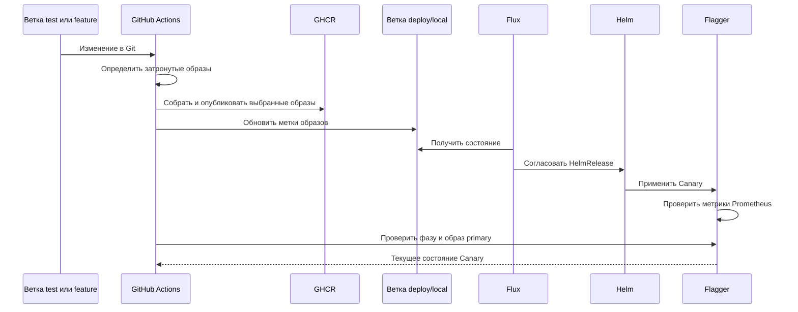

# Развертывание и доставка изменений

## Предварительные условия

Для локальных сценариев нужны Docker Desktop с включенным Kubernetes,
`kubectl`, PowerShell и доступный Docker Engine. Сценарии Istio и Helm
загружают закрепленные версии инструментов в `.tools/mesh`.

Перед запуском проверьте:

```powershell
docker info
kubectl cluster-info
kubectl get nodes
```

Ключи JWT должны находиться в `keys/private.pem` и `keys/public.pem`.
Секреты не хранятся в Git.

## Контур `local`

Команда:

```powershell
.\k8s\scripts\apply.ps1
```

`apply.ps1` выполняет действия в следующем порядке:

1. Создает `overlays/local/secrets/runtime.env` из примера, если файла нет.
2. Применяет `Namespace/automatic-system`.
3. Создает `runtime-secrets` из локального файла и отдельные секреты JWT.
4. Применяет `overlays/local/infra`: отдельные PostgreSQL, Redis, Kafka,
   MinIO, ClickHouse, Valhalla и MailHog.
5. Ожидает готовность StatefulSet и вспомогательных Deployment.
6. Удаляет прежние Job с метками типов `migration` и `init`.
7. Применяет `overlays/local/migrations` и ожидает `kafka-init`.
8. Выпускает приложения через
   `deploy-applications-helm.ps1 -Environment local`.
9. Показывает поды и службы пространства имен.

Этот контур предназначен для разработки. Он не проверяет переключение Patroni,
распределение Citus и канареечное продвижение.

## Контур `local-ha`

Команда:

```powershell
.\k8s\scripts\start-local-ha.ps1
```

Доступные параметры:

| Параметр | Действие |
|---|---|
| `-SkipBuild` | Не собирать локальные образы. |
| `-SkipImageImport` | Не загружать образы в контейнеры узлов локального кластера. |
| `-ResetSecrets` | Создать новые секреты; запрещено при существующих данных без `-ResetData`. |
| `-ResetData` | Удалить пространство `automatic-system` вместе с локальными томами и создать его заново. |
| `-SkipApplications` | Развернуть только данные и вспомогательные компоненты. |

Последовательность:

1. Проверяется доступность Kubernetes и устанавливается Metrics Server.
2. Собираются приложения, миграторы, Frontend, Patroni, Citus, PgBouncer и
   вспомогательный образ kubectl.
3. Образы потоково импортируются в каждый локальный узел.
4. При `-ResetData` удаляется пространство имен.
5. Создаются случайные локальные пароли, строки подключения, секреты MinIO,
   ClickHouse, внутреннего Report API и JWT.
6. Серверным применением создаются Patroni, Citus, PgBouncer, MinIO,
   наблюдаемость, журналы и правила Istio.
7. Ожидаются платформенный Patroni, координатор и рабочие группы Citus и MinIO.
8. Отдельно применяется `local-ha/support`: Kafka, Redis, ClickHouse,
   Valhalla и MailHog.
9. Запускаются начальные задания, затем распределение таблиц Ticket по Citus.
10. Единый Helm-чарт выпускает приложения с
    `values.yaml + values-local-ha.yaml`.

Valhalla может продолжать загрузку и построение графа после завершения основной
команды. Готовность пода без успешного `/locate` и дорожного `/route` не
доказывает готовность маршрутизации.

## Контур `dev`

`overlays/dev` использует пространство `automatic-system-dev`. Его каталоги
`apps` пусты: приложения должны выпускаться Helm, а не дублироваться
Kustomize.

```powershell
kubectl apply -k k8s/overlays/dev
.\k8s\scripts\deploy-applications-helm.ps1 `
  -Environment dev `
  -ImageTag sha-<commit> `
  -MigratorTag sha-<commit>
```

Для `dev` обязательны неизменяемые метки приложений и миграторов.

## Контур `prod`

`overlays/prod` включает пространство, наблюдаемость, Istio-политику,
производственную сеть, Patroni/Citus/PgBouncer и миграционные заготовки. Он не
выпускает приложения Kustomize.

До применения необходимо заменить:

- `sha-0000000` у образов PostgreSQL HA, Citus и PgBouncer;
- метки миграторов в `overlays/prod/migrations/kustomization.yaml`;
- класс `standard-rwo`, если в кластере используется другой StorageClass;
- значения и внешнее управление секретами.

Проверка сборки без изменения кластера:

```powershell
kubectl kustomize k8s/overlays/prod
```

Ручной выпуск приложений:

```powershell
.\k8s\scripts\deploy-applications-helm.ps1 `
  -Environment prod `
  -ImageTag sha-<commit> `
  -MigratorTag sha-<commit>
```

`--atomic --wait` откатывает ресурсы Helm при неготовности, но не возвращает
схему базы данных. Поэтому изменения схемы должны поддерживать предыдущую и
новую версии приложения в течение выпуска.

## Helm-выпуск приложений

`deploy-applications-helm.ps1` всегда использует выпуск `applications`.
Пространство выбирается по окружению. Параметр `-SkipMigrations` отключает
PostgreSQL Job, инициализацию ClickHouse и миграцию Dispatch.

`-TakeOwnership` применяется только один раз при передаче уже существующих
ресурсов от Kustomize к Helm. На обычных обновлениях он не нужен.

Проверка истории и откат:

```powershell
& .\.tools\mesh\helm.exe history applications -n automatic-system
& .\.tools\mesh\helm.exe rollback applications <revision> `
  -n automatic-system --wait
```

## Выборочная сборка сервисов

CI определяет изменившиеся пути и формирует набор матрицы сборки. Для каждого
затронутого сервиса публикуется собственный образ с меткой
`sha-<12 символов commit>`. Неизменившиеся сервисы сохраняют прежние метки в
`globalImage.tags`; миграторы используют `migrations.tags`.



Схема относится только к локальному выпуску после `push` в `test` или
`feature`. Условия задания и проверка продвижения находятся в
[`ci.yml`](../../.github/workflows/ci.yml).

Следствия:

- изменение одного сервиса пересобирает и обновляет только его образ;
- изменение двух сервисов создает две записи матрицы;
- изменение общих контрактов, общих файлов сборки или чарта может расширить
  набор, поскольку влияет сразу на несколько потребителей;
- `main`, `master`, ручной запуск и первое событие без предыдущего коммита
  принудительно выбирают все цели; выборочность относится к обычным
  изменениям `test` и `feature/**`;
- если приложение не изменилось, ожидание Flagger должно завершаться без
  запроса Canary с пустым именем.

Точные поля Helm, Canary и Flux разобраны в
[справочнике ресурсов](resource-fields.md).

## Flux для `local-ha`

`install-flux.ps1` устанавливает Flux 2.9.5 и права исполнителя. Без
`-ConfigureLocalHASync` согласование Git намеренно не включается.

```powershell
.\k8s\scripts\install-flux.ps1 -ConfigureLocalHASync
```

`GitRepository/automatic-system` следит только за `deploy/local`.
`Kustomization/automatic-system-local-ha` читает
`./k8s/flux/clusters/local-ha`, работает с `prune: true`, ожидает готовность
до 40 минут и изначально создается с `suspend: true`.

Первое ручное включение:

```powershell
kubectl patch kustomization automatic-system-local-ha `
  -n flux-system --type merge `
  -p '{"spec":{"suspend":false}}'
```

Flux согласует:

1. пространство и репозиторий Flagger;
2. Flagger и его генератор трафика;
3. правила и входящие маршруты Istio;
4. `HelmRelease/applications` с включенным `canary.enabled`.

Состояние:

```powershell
kubectl get gitrepository,kustomization,helmrelease -n flux-system
kubectl describe kustomization automatic-system-local-ha -n flux-system
```

## Flagger

Шаблон `canaries.yaml` создает Canary только для включенных элементов
`canary.services` и необязательного `serviceFilter`. Метрики берутся из
`http://prometheus.automatic-system.svc.cluster.local:9090`.

Настройки по умолчанию:

| Параметр | Значение |
|---|---|
| Интервал анализа | 1 минута |
| Допустимое число неудачных проверок | 5 |
| Максимальная доля канарейки | 25% |
| Шаг увеличения | 5% |
| Минимальная успешность | 99% |
| Максимальная длительность запроса | 1500 мс |
| Предельное время продвижения | 600 секунд |

Во время выпуска Flagger управляет `<service>-primary` и
`<service>-canary`. После успешного продвижения канареечное Deployment
масштабируется до нуля. Строка `0/0` в этот момент является нормальным
состоянием сохраненного объекта, а не старым работающим подом.

Проверка:

```powershell
kubectl get canary -n automatic-system
kubectl describe canary <service> -n automatic-system
kubectl get deploy,rs,pod -n automatic-system -l app=<service>
```

## Порядок безопасного изменения манифестов

1. Изменить базу или нужное наложение, не дублируя владельца ресурса.
2. Собрать Kustomize и отрисовать Helm локально.
3. Проверить итоговые имена, пространства, селекторы, секреты и образы.
4. Убедиться, что миграция обратно совместима.
5. Применить в `local` или `local-ha`.
6. Проверить события, готовность, метрики и трассировки.
7. Только после этого переносить неизменяемые метки в `prod`.
