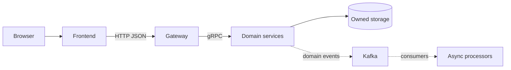

# Обзор архитектуры

## Стиль архитектуры

Система сочетает:

- предметно разделённые микросервисы;
- синхронный gRPC для обязательных шагов текущей операции;
- асинхронные domain events через Kafka;
- transactional outbox для большинства publishers;
- отдельные storage technologies по характеру данных;
- orchestration через Kubernetes и service mesh через Istio.

## Основной request path

Gateway не становится доменным владельцем. Он выполняет transport concerns: request ID, idempotency metadata, rate limiting, logging, JWT verification, DTO mapping и gRPC error mapping.

## Консистентность и конкуренция

| Механизм | Где используется | Зачем |
|---|---|---|
| Transactional outbox | Auth, Profile, Department, Brigade, Ticket, Dispatch, Routing, Asset, SLA, Report | Не отделять бизнес-изменение от фиксации исходящего события. |
| Redis Stream → Kafka | Location | События координат рождаются рядом с оперативным Redis-state. |
| Idempotency key | Несколько write flows, включая Auth/Ticket/Profile | Безопасный retry одного и того же изменения. |
| Optimistic version | Dispatch operation | Защита переходов операции назначения. |
| `FOR UPDATE SKIP LOCKED` | SLA scanner, Report queue | Параллельные workers без двойного захвата одной работы. |
| Append-only DB protection | Audit | Запрет изменения уже записанного аудита. |
| Durable DB + best-effort live publish | Notification | WebSocket/live failure не уничтожает уведомление. |

## Важная граница доказательств

Схема этой Wiki показывает связи, найденные в запускаемом коде и обработчиках. Настроенный URL, topic или поле клиента сам по себе не считается реализованным вызовом.

См. [Service Communication](Service-Communication) и [Event-Driven Architecture](Event-Driven-Architecture).

### Источники
- [code-interactions.md](https://github.com/FIZZI-77/automatic_system/blob/test/docs/architecture/code-interactions.md)
- [README.md](https://github.com/FIZZI-77/automatic_system/blob/test/README.md)
