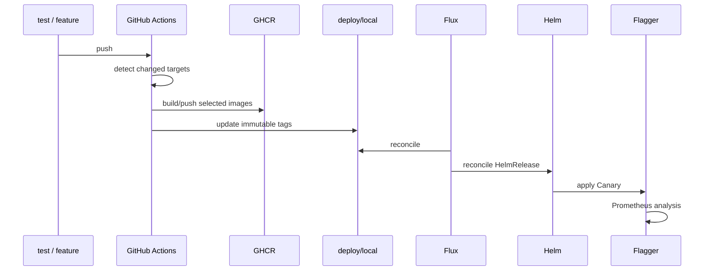

# CI/CD

Workflow расположен в `.github/workflows/ci.yml`.

## Условия запуска

- pull request;
- push в `feature`, `feature/**`, `test`, `main`, `master`;
- ручной запуск `workflow_dispatch`.

Версия Go в workflow: **1.25.9**.

## Проверки качества

### Go

Каждый module проверяется отдельно с `GOWORK=off`:

1. `go mod download`;
2. `go mod verify`;
3. `gofmt`;
4. `go vet ./...`;
5. `go test -race -count=1 ./...`.

Gateway дополнительно проверяет OpenAPI generation/spec consistency.

### Интеграционные тесты

- Analytics: реальный ClickHouse container + integration tests.
- Location: интеграционный пакет PostgreSQL/Redis.

### Клиентское приложение

- целевые проверки ESLint;
- production-сборка;
- компиляция набора тестов Playwright.

### Проверка репозитория и платформы

- проверка путей `go.work`;
- `docker compose config --quiet`;
- Kustomize render для `local`, `dev`, `prod`;
- проверка и рендеринг Helm;
- reject mutable `latest/dev` application tags в production render.

## Выборочная сборка

CI определяет затронутые components и собирает только изменившиеся application/migrator images. Общие contracts/build/chart changes могут расширить матрицу.

Тег образа: `sha-<12 символов>`.

## Путь доставки

Локальный GitOps/canary flow документирован для push в `test`/`feature` и `deploy/local`.

### Источники
- [CI workflow](https://github.com/FIZZI-77/automatic_system/blob/test/.github/workflows/ci.yml)
- [Deployment guide](https://github.com/FIZZI-77/automatic_system/blob/test/k8s/docs/deployment.md)
