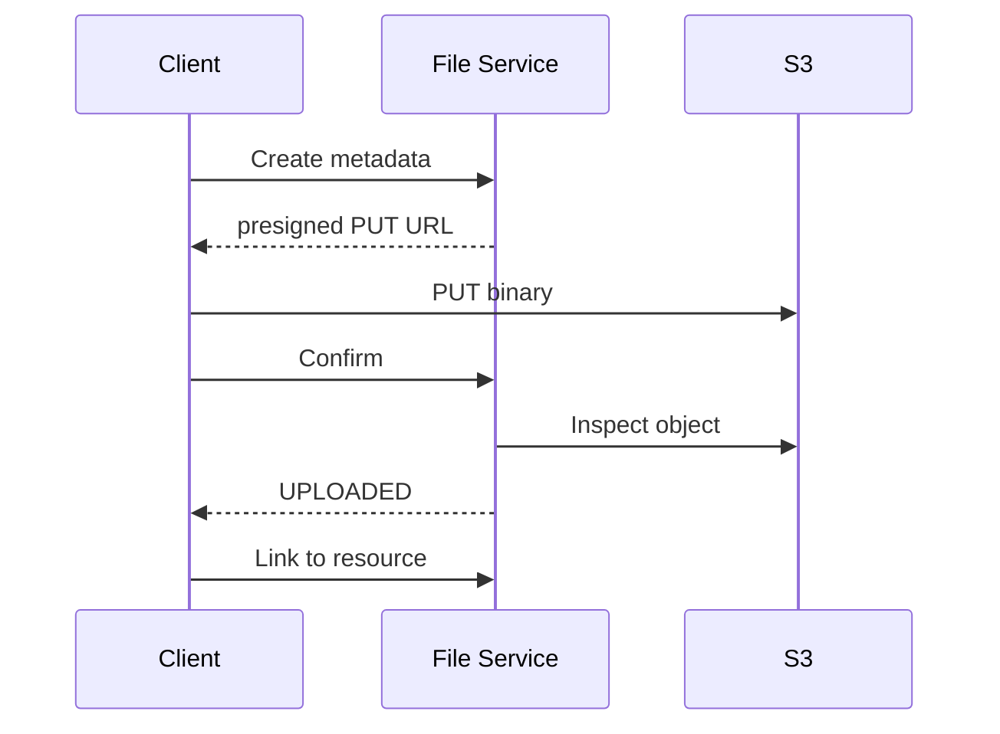

# Данные и хранилища

## Владение хранилищами

| Компонент | Хранилище / внешняя система |
|---|---|
| API Gateway | Redis для rate limiting и live notifications |
| Auth | PostgreSQL, SMTP |
| Profile | PostgreSQL |
| Department | PostgreSQL |
| Brigade | PostgreSQL |
| Ticket | PostgreSQL; Citus определяется deployment layer |
| Dispatch | PostgreSQL |
| Location | Redis + PostgreSQL/PostGIS |
| Routing | PostgreSQL + Valhalla |
| Asset | PostgreSQL/PostGIS |
| File | PostgreSQL + S3-compatible storage |
| SLA | PostgreSQL |
| Notification | PostgreSQL + Redis + SMTP + optional FCM |
| Audit | PostgreSQL |
| Analytics | ClickHouse |
| Report | PostgreSQL + Analytics/File clients |

## Почему несколько storage engines

- **PostgreSQL** — транзакционное состояние предметных областей.
- **PostGIS** — пространственные запросы, история и геозоны.
- **Redis** — последняя позиция с низкой задержкой, мост потоков/событий и оперативное состояние шлюза.
- **ClickHouse** — событийные аналитические проекции и агрегации.
- **S3/MinIO** — binary artifacts; metadata остаются в PostgreSQL.
- **Valhalla** — routing engine, а не системная БД.

## Путь файловых данных

Бинарные данные не проксируются через gRPC.

### Источники
- [code-interactions.md](https://github.com/FIZZI-77/automatic_system/blob/test/docs/architecture/code-interactions.md)
- [File Service README](https://github.com/FIZZI-77/automatic_system/blob/test/File_Service/README.md)
