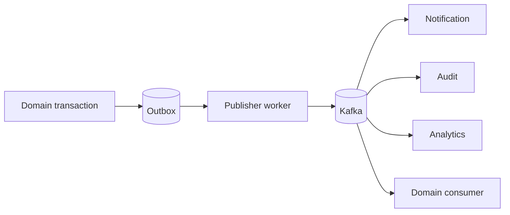

# Событийная архитектура

## Издатели

| Publisher | Topic | Источник публикации |
|---|---|---|
| Auth | `auth.events.v1` | Outbox |
| Profile | `profiles.events.v1` | Outbox |
| Department | `departments.events.v1` | Outbox |
| Brigade | `brigades.events.v1` | Outbox |
| Ticket | `tickets.events.v1` | Outbox |
| Dispatch | `dispatch.events.v1` | Outbox |
| Routing | `routing.events.v1` | Outbox |
| Location | `locations.events.v1` | Redis Stream → Kafka |
| Asset | `assets.events.v1` | Outbox |
| SLA | `sla.events.v1` | Outbox |
| Report | `reports.events.v1` | Outbox |

## Потребители

| Consumer | Topics |
|---|---|
| Brigade | `profiles.events.v1`, `routing.events.v1`, `tickets.events.v1` |
| Ticket | `routing.events.v1`, `reports.events.v1` |
| Dispatch | `tickets.events.v1` |
| Routing | `tickets.events.v1` |
| SLA | `tickets.events.v1` |
| Report | `tickets.events.v1` |
| Notification | tickets, sla, dispatch, departments, brigades, locations, routing, files, reports (`*.events.v1`) |
| Audit | auth, tickets, departments, brigades, profiles, locations, routing, dispatch, sla, notifications, reports, assets |
| Analytics | auth, tickets, departments, brigades, profiles, locations, routing, dispatch, sla, notifications, reports, assets |

## Реализовано и настроено

Есть две важные асимметрии:

1. Notification настроен читать `files.events.v1`, но в текущем запуске File Service нет Kafka publisher.
2. Audit/Analytics настроены читать `notifications.events.v1`, но текущий Notification Service не публикует Kafka events.

Поэтому topic в consumer config нельзя автоматически трактовать как рабочий end-to-end event path.

## Общая модель

Location является исключением из стандартной outbox-схемы и использует Redis Stream как источник для передачи coordinate events в Kafka.

### Источники
[code-interactions.md](https://github.com/FIZZI-77/automatic_system/blob/test/docs/architecture/code-interactions.md)
