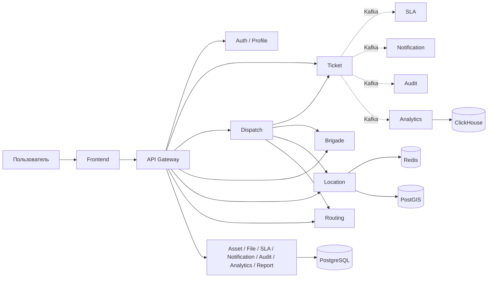
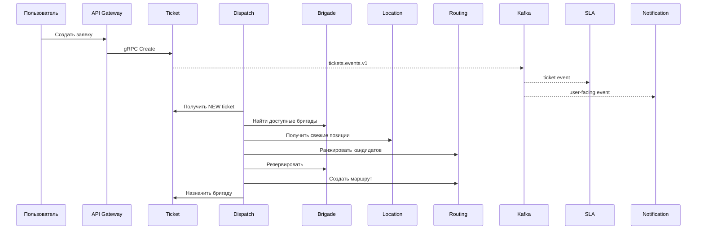

# Automatic City Services

> Техническая Wiki микросервисной системы управления городскими обращениями.

**Проверено:** 17 сентября 2026 года по текущему рабочему дереву ветки `test`.

Automatic City Services ведёт заявку от сообщения жителя до назначения бригады, выполнения работ, контроля SLA, уведомлений, аудита и аналитики. Система разделена на предметные сервисы; синхронные операции выполняются через gRPC, независимая последующая обработка — через Kafka.

## С чего начать

- [Обзор системы](System-Overview) — назначение, роли, стек и границы.
- [Архитектура](Architecture-Overview) — предметные границы, синхронные и асинхронные связи.
- [Взаимодействие сервисов](Service-Communication) — только подтверждённые кодом прямые вызовы.
- [Событийная архитектура](Event-Driven-Architecture) — издатели и потребители Kafka, а также реальные ограничения.
- [Жизненный цикл заявки](Ticket-Lifecycle) — Ticket, Dispatch, Routing, Work Report.
- [Каталог сервисов](Services) — ответственность каждого компонента.
- [Kubernetes](Kubernetes) — `local`, `local-ha`, `dev`, `prod`.
- [CI/CD](CI-CD) и [канареечное развёртывание](Canary-Deployment).
- [Наблюдаемость](Observability), [тестирование и нагрузка](Testing-and-Load), [эксплуатация](Operations).

## Архитектурные принципы

1. **Gateway не является владельцем бизнес-данных.** Он выполняет HTTP↔gRPC адаптацию, authentication/authorization, rate limiting и нормализацию ошибок.
2. **Предметные данные имеют явного владельца.** Ticket, Brigade, Location, Asset и другие сервисы сохраняют собственные модели.
3. **Синхронная связь используется только там, где результат нужен в текущей операции.**
4. **Kafka используется для независимых реакций на изменения.** Большинство издателей применяют transactional outbox.
5. **Наличие topic в конфигурации не равно наличию publisher в коде.** В Wiki отдельно отмечены такие случаи.
6. **Инфраструктура рассматривается как часть системы:** Kubernetes, Istio, Flux, Helm, Flagger, Prometheus и tracing документированы вместе с приложениями.

## Основной бизнес-путь

## Источники истины этой Wiki

Wiki собрана по текущему коду и документации репозитория. Для спорных связей приоритет имеют точки запуска и реальные клиенты/consumers, а не старые схемы.

- [README проекта](https://github.com/FIZZI-77/automatic_system/blob/test/README.md)
- [Карта взаимодействий по коду](https://github.com/FIZZI-77/automatic_system/blob/test/docs/architecture/code-interactions.md)
- [Kubernetes deployment](https://github.com/FIZZI-77/automatic_system/blob/test/k8s/docs/deployment.md)
- [Security & observability](https://github.com/FIZZI-77/automatic_system/blob/test/k8s/docs/security-observability.md)
- [Operations](https://github.com/FIZZI-77/automatic_system/blob/test/k8s/docs/operations.md)
- [CI workflow](https://github.com/FIZZI-77/automatic_system/blob/test/.github/workflows/ci.yml)
