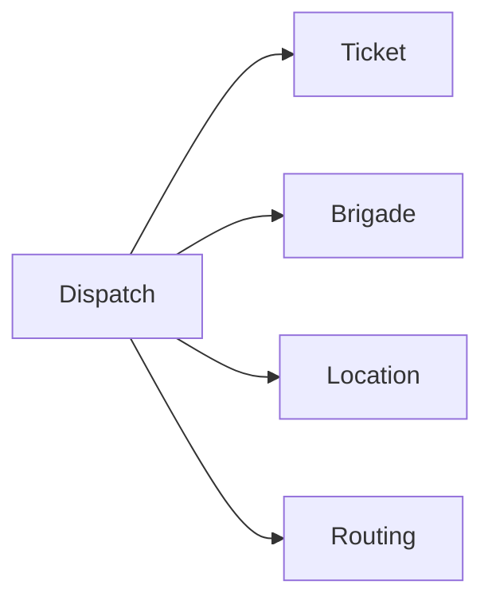

# Взаимодействие сервисов

Ниже перечислены **прямые связи, подтверждённые текущим кодом**.

## Синхронные вызовы

| Откуда | Куда | Механизм / смысл |
|---|---|---|
| Frontend | API Gateway | Предметные HTTP-запросы клиента. |
| Frontend server routes | Nominatim, Overpass API, Valhalla | Геокодирование, инфраструктурные объекты, маршрут. |
| Browser | S3-compatible storage | Upload/download по presigned URL. |
| API Gateway | Auth, Profile, Department, Brigade, Ticket, Dispatch, Location, Routing, Asset, File, SLA, Notification, Audit, Analytics, Report | 15 gRPC clients. |
| API Gateway | Ticket, Brigade, Profile | Подготовка снимка completion report. |
| Auth | Profile | Создание/связь профиля после auth flow. |
| Profile | Auth, Department | Проверка account и подразделения. |
| Brigade | Profile, Department | Проверка профиля/skills и domain constraints. |
| Dispatch | Ticket, Brigade, Location, Routing | Workflow назначения. |
| Report | Analytics, File | Данные отчёта и сохранение готового artifact. |
| Transponder Simulator | Location | HTTP telemetry. |

## Что намеренно не рисуется

- Ticket Service **не** создаёт gRPC clients Department или Brigade в текущей точке запуска.
- Наличие конфигурационного адреса Report в Gateway не означает вызов: completion report создаётся в Ticket, а генерация документа идёт через Kafka.
- Monitoring/network/storage connections не смешиваются с domain call graph.

## Dispatch как главный synchronous orchestrator

Dispatch не копирует ownership этих данных. Его собственная PostgreSQL-модель — операция назначения и её состояние.

### Источники
[Проверенная карта взаимодействий по коду](https://github.com/FIZZI-77/automatic_system/blob/test/docs/architecture/code-interactions.md)
