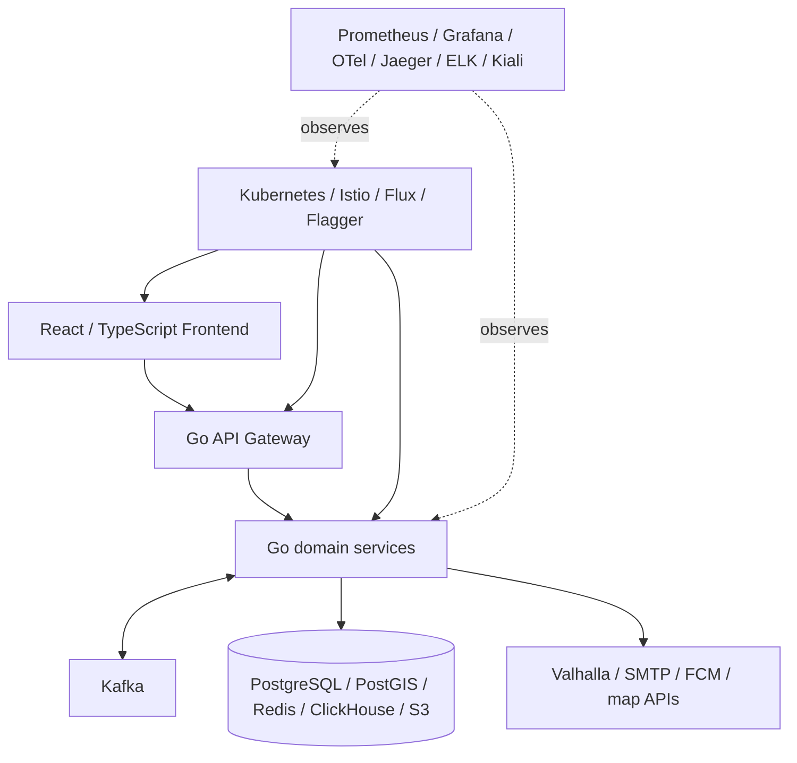

# Обзор системы

## Назначение

Automatic City Services автоматизирует обработку городских обращений: регистрацию пользователя, создание заявки, назначение бригады, построение маршрута, выполнение работ, контроль сроков, уведомления, аудит и аналитику.

## Роли

| Роль | Основные сценарии |
|---|---|
| Житель | Создание и просмотр собственных заявок, профиль, уведомления. |
| Работник | Задания бригады, маршрут, изменение состояния работы, отчёт о выполнении. |
| Диспетчер | Карта, заявки, бригады, ручное/автоматическое назначение, SLA и операции. |
| Администратор | Справочники, пользователи/профили, подразделения, активы, аналитика, аудит, отчёты. |

Конкретное разрешение действия определяется серверной авторизацией. Скрытие пункта меню во Frontend не является механизмом доступа.

## Логические слои

## Основной стек

| Область | Технологии |
|---|---|
| Backend | Go, gRPC, HTTP |
| Frontend | React, TypeScript, Vinext/Vite, Leaflet |
| Transactional data | PostgreSQL |
| Geo | PostGIS |
| Operational state | Redis |
| Events | Kafka |
| Analytics | ClickHouse |
| Object storage | S3-compatible storage / MinIO |
| Routing | Valhalla |
| Orchestration | Kubernetes, Kustomize, Helm |
| Service mesh | Istio |
| GitOps / delivery | GitHub Actions, Flux, Flagger |
| Metrics | Prometheus, Grafana |
| Tracing | OpenTelemetry, Jaeger |
| Logs | Filebeat, Elasticsearch, Kibana |
| Mesh UI | Kiali |

## Границы сервисов

Система не использует одну «главную» прикладную таблицу на все домены. Владельцами данных являются отдельные сервисы:

- Ticket — заявка, категория, история, work report.
- Brigade — состав и готовность бригад.
- Location — текущая позиция и геоистория.
- Routing — сохранённые маршруты.
- Asset — городские объекты и техническая история.
- Auth/Profile — учетная запись и пользовательские/рабочие профили.
- Analytics — аналитическая проекция, но не источник истины бизнес-сущностей.

## Состояние документации

Wiki проверена 17 сентября 2026 года по текущему рабочему дереву ветки `test`.
Ссылки на исходный код ведут на эту ветку, поэтому страницы и архитектурные
схемы необходимо обновлять вместе с кодом.
