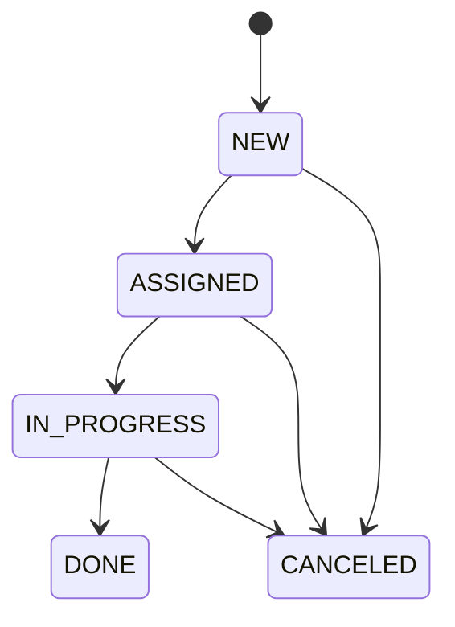
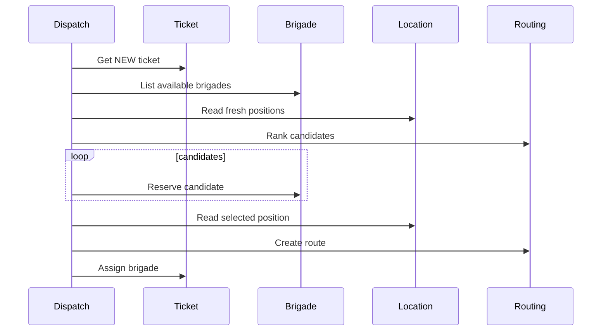
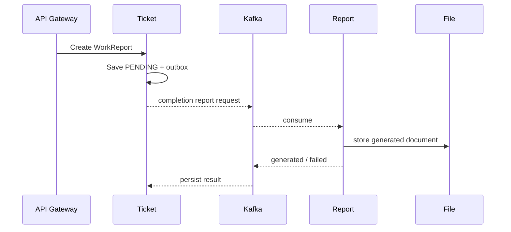

# Жизненный цикл заявки

## Состояния заявки

`DONE` и `CANCELED` — terminal states прикладной модели. В базе также предусмотрен `ARCHIVED` для хранения старых данных, но он не входит в публичный `TicketStatus`.

## Создание

1. Пользователь аутентифицируется через Auth.
2. Frontend отправляет HTTP request в Gateway.
3. Gateway проверяет JWT и вызывает Ticket по gRPC.
4. Ticket сохраняет заявку и outbox event.
5. `tickets.events.v1` может быть обработан SLA, Notification, Audit, Analytics и другими consumers.

## Назначение

При ошибке подтверждения Dispatch выполняет компенсацию достигнутых шагов — например, отменяет маршрут или освобождает бригаду.

## Выполнение

Worker может перевести назначенную своей бригаде заявку в `IN_PROGRESS`, затем в `DONE`, и добавить work report.

## Отчёт о завершении

Источник истины о work report остаётся в Ticket; Report отвечает за формирование artifact.

### Источники
- [Ticket Service README](https://github.com/FIZZI-77/automatic_system/blob/test/Ticket_Service/README.md)
- [Dispatch Service README](https://github.com/FIZZI-77/automatic_system/blob/test/Dispatch_Service/README.md)
